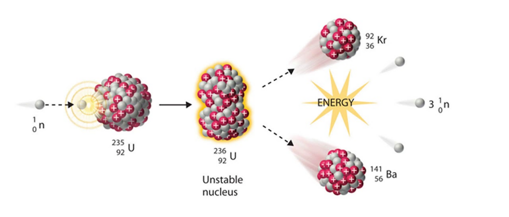
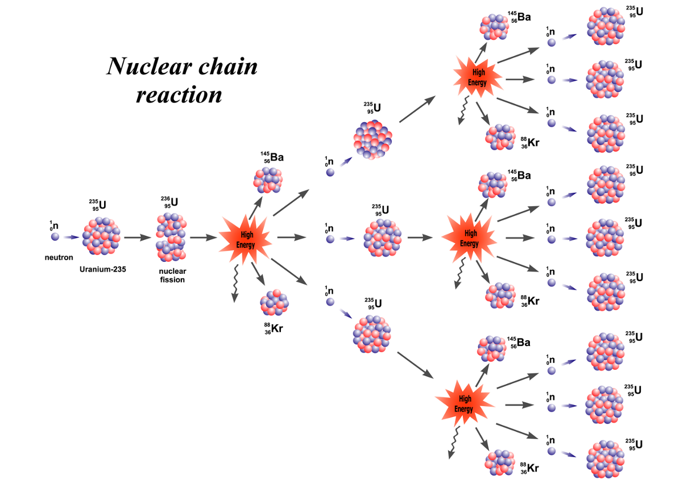

# 1. 쿠버네티스를 왜 사용할까요?
  

:::note <b>강의를 통해 얻을 수 있는 것</b>
1. 실제 비즈니스에서 쿠버네티스를 왜 사용하는지 이해할 수 있습니다.
2. 위 개념을 바탕으로 실제 애플리케이션을 쿠버네티스 환경에 배포할 수 있습니다.
3. 배포된 어플리케이션의 상태를 파악하고 문제를 해결할 수 있습니다.  

:::
 

----

 

### 핵분열

      

### 핵폭탄

 
<h3 align="center"> → 쿠버네티스를 이용하면 에러의 연쇄 반응(핵폭탄)을 막을 수 있습니다.</h3>