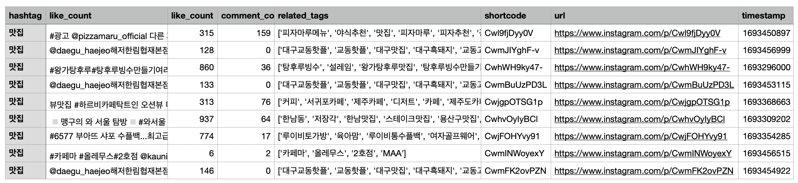
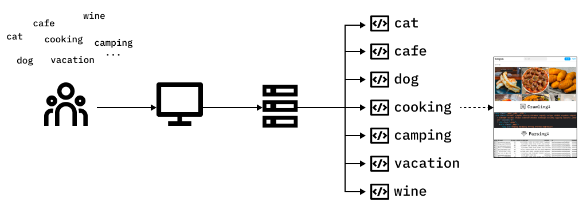

# 서비스 소개
 

## 제공하는 기능
SNS에 있는 비정형 데이터(html, css)를 크롤링해서 아래와 같이 정형 데이터(csv)로 만들어서 사용자에게 제공합니다.

<h1 align="center"> &darr;</h1>

 

----

## 서비스 시나리오

### 1. 검색 요청
 

### 2. 요청 받기
 

### 3. 요청에 대한 작업 처리
 

     

### 좀 더 직관적으로 표현하면 다음과 같습니다.

   

---
  

## 어떠한 구조로 비즈니스 아키텍쳐를 설계할 것인가?

