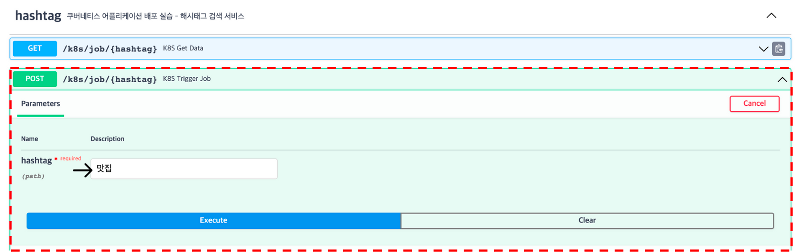
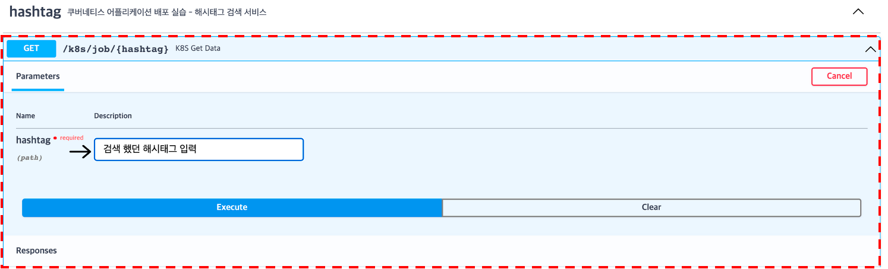

# 5. 어플리케이션 사용해보기
<br/>

## 생성된 어플리케이션을 사용해보겠습니다.
<br/>

### 서비스 이용하기

#### QUIZ - 외부에서 접근하려면 어떻게 해야할까?
```bash
curl http://?
```
→ 웹을 통해서 요청도 가능함
<br/>

#### 해시태그 검색 요청 해보기

<br/><br/>

#### 쿠버네티스 명령어로 확인
```bash
kubectl get pods -n k8s-edu-ondemand-crawling
```
<br/>

#### 파드 내부 상태를 쿠버네티스 명령어로 확인
```bash
kubectl exec -it {pod_name} -n k8s-edu-ondemand-crawling /bin/bash
```
<br/>

#### 와탭에서 확인
→ 컨테이너 맵에서 k8s-edu-ondmand-crawling 네임스페이스 파드 선택

### 검색한 데이터 조회하기

<br/><br/>