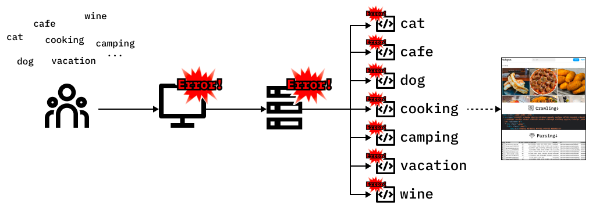
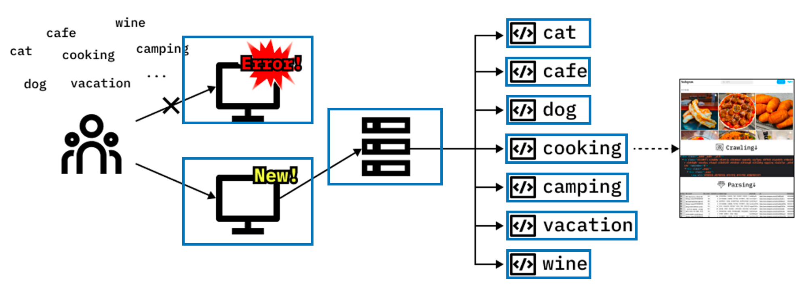
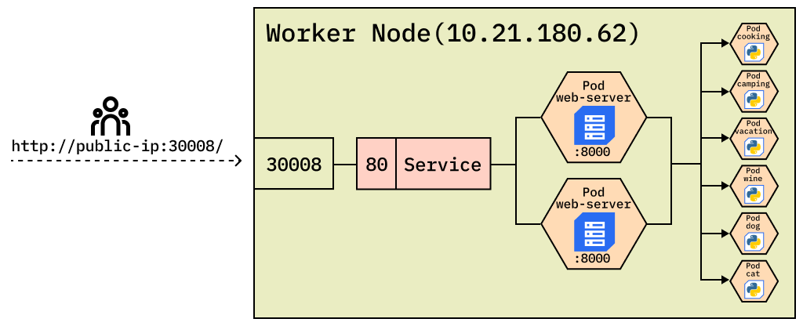

# 3. 서비스 아키텍쳐
  

### 모놀리식(Monolithic)
 
여러 비즈니스 기능이 하나의 공간에서 수행되는 전통적인 구조입니다.
  

<h3 align="center"> →  하나의 모듈에서 문제 발생 시 연쇄 반응</h3>
   

### MSA
작은 단위의 비즈니스 기능을 독립적으로 실행하는 구조입니다.
  

<h3 align="center"> →  서로의 환경에 영향을 주지 않음, 서비스 중지 최소화(가용성)</h3>
      

### 쿠버네티스 친화적 구조도

      

