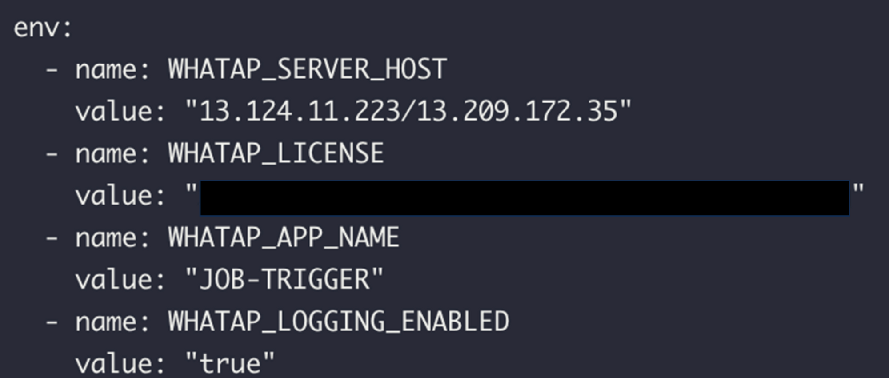
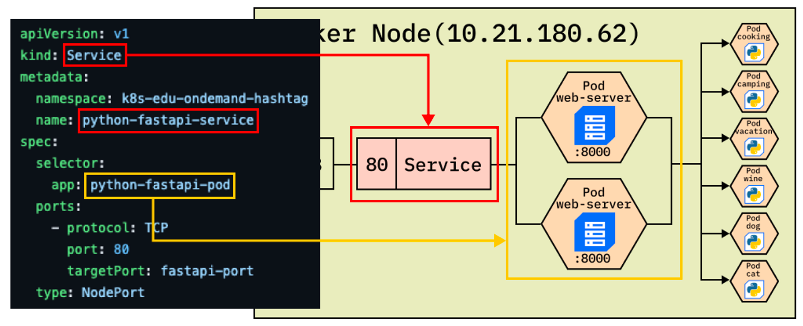
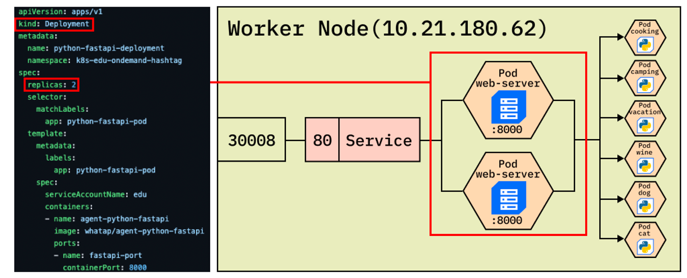
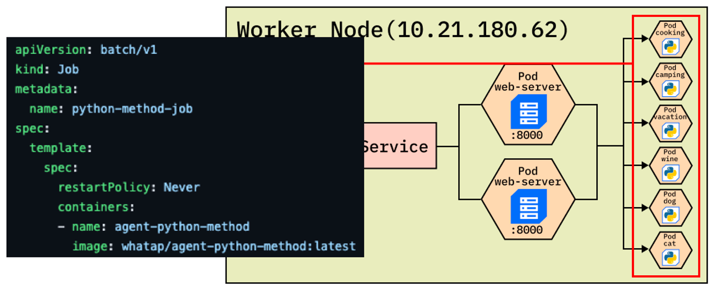
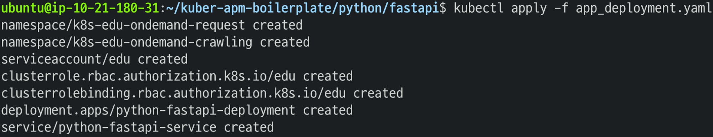

# 4. 트리니티 테스트
<br/>

## 서비스, 디플로이먼트, 잡을 실제로 생성해보자
<br/>

### 사전작업 - 1. 어플리케이션 yaml 파일 다운
```bash
git clone https://github.com/whatap/kuber-apm-boilerplate
```
<br/>

```bash
cd kuber-apm-boilerplate/python/fastapi/
```
<br/>

### 사전작업 - 2. 와탭 설정

#### 수집서버
```bash
sed -i 's/{WHATAP_SERVER_HOST}/"13.124.11.223\/13.209.172.35"/g' app_deployment.yaml
```
<br/>

#### 라이센스 키 
그대로 복사 하면 안됨, YOUR-LICENSE-KEY 에 자신의 와탭 라이센스 키 입력
```bash
sed -i 's/{WHATAP_LICENSE}/"YOUR-LICENSE-KEY"/g' app_deployment.yaml
```
<br/>


#### 와탭에서 인식할 아이디 설정
```bash
sed -i 's/{WHATAP_APP_NAME}/"JOB-TRIGGER"/g' app_deployment.yaml
```
<br/>

#### 와탭 로그 설정
```bash
sed -i 's/{WHATAP_LOGGING_ENABLED}/"true"/g' app_deployment.yaml
```
<br/>

#### 결과 확인

```bash
cat app_deployment.yaml
```



<br/><br/>

## 어플리케이션 yaml 파일실행
<br/><br/>

### 1. SERVICE - 노드포트 서비스 생성합니다.
<br/><br/><br/><br/>


<br/><br/><br/><br/><br/>

### 2. Deployment - 웹서버의 역할을 하는 파드를 배포합니다.
<br/><br/><br/><br/>


<br/><br/><br/><br/><br/>

### 3. JOB - 웹서버의 요청을 받아 작업(크롤링, 파싱)을 수행합니다.
<br/><br/><br/><br/>


<br/><br/><br/><br/><br/>


### 위 3가지 오브젝트(service, deployment, job) 생성

```bash
kubectl apply -f app_deployment.yaml
```
<br/>

### 결과 확인


#### 디플로이먼트 확인

```bash
kubectl get deployments -n k8s-edu-ondemand-request
```

#### 서비스 확인

```bash
kubectl get services -n k8s-edu-ondemand-request
```

#### 파드 확인

```bash
kubectl get pods -n k8s-edu-ondemand-request
```
<br/>

#### 와탭에서 확인

- 대시보드> 컨테이너 맵
- 네임스페이스 : **k8s-edu-ondemand-request**