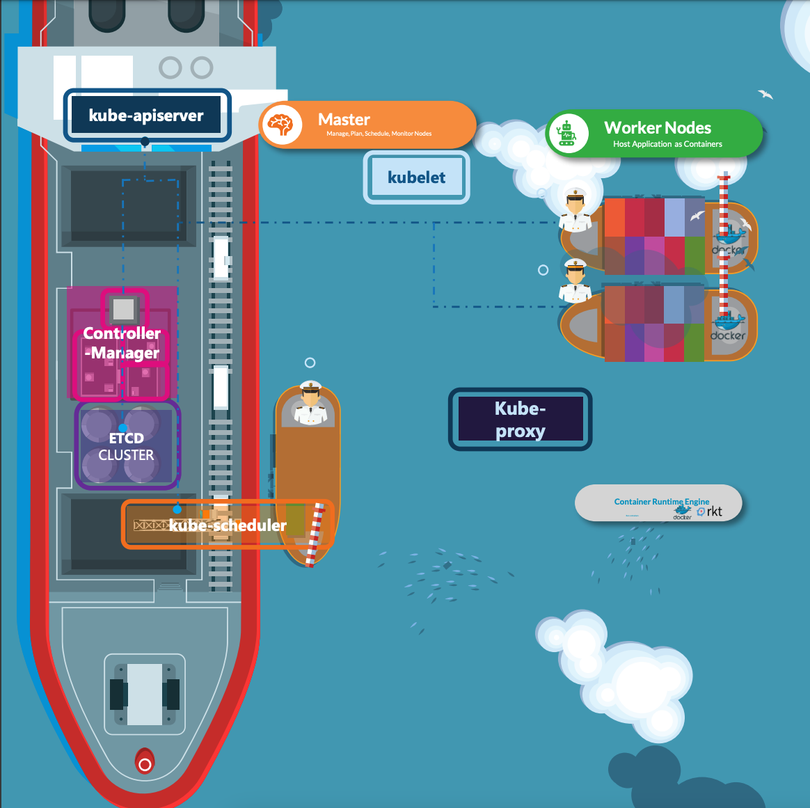
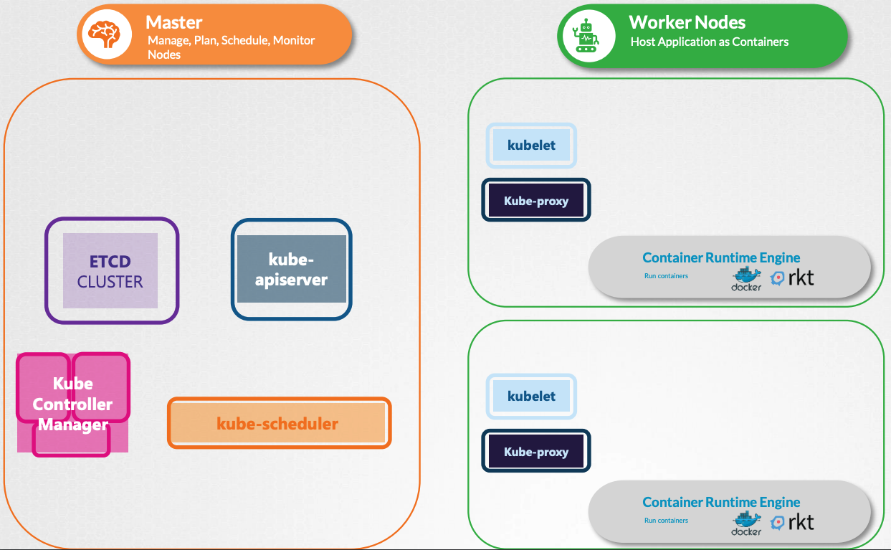
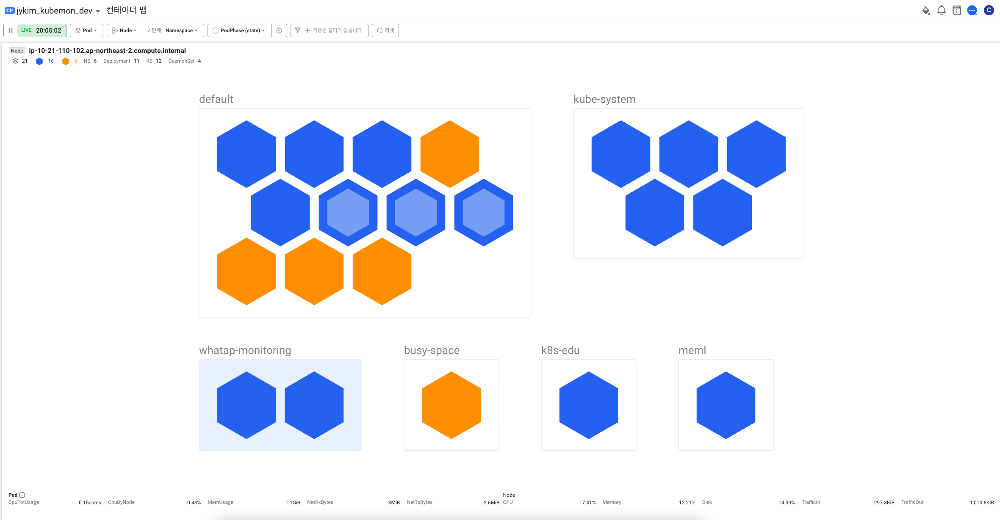
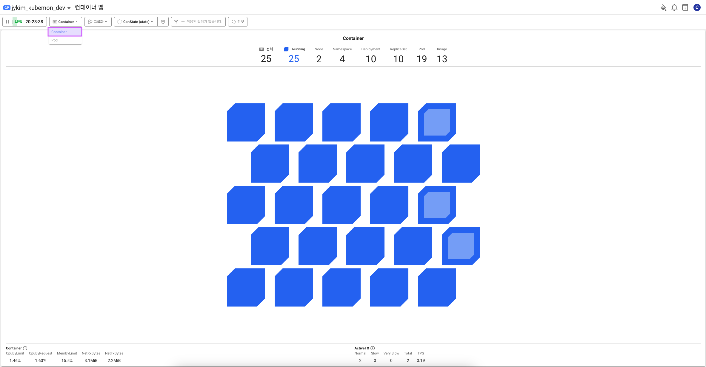
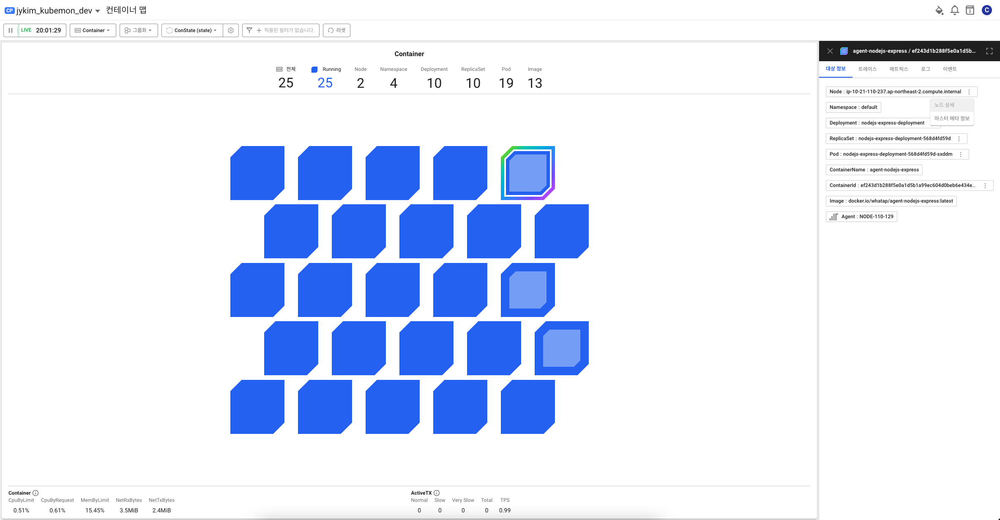
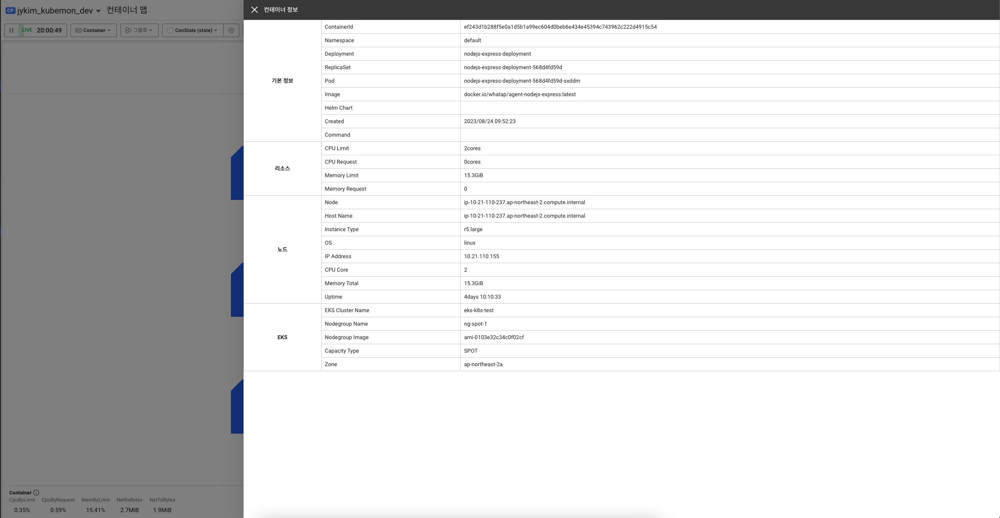
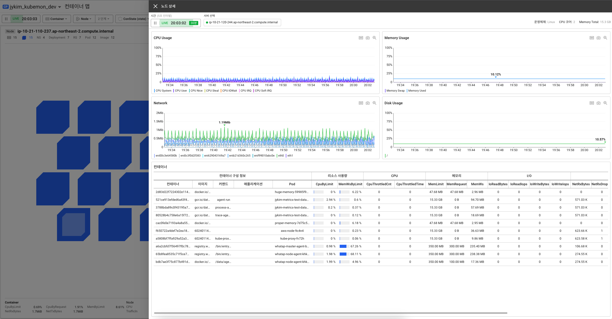
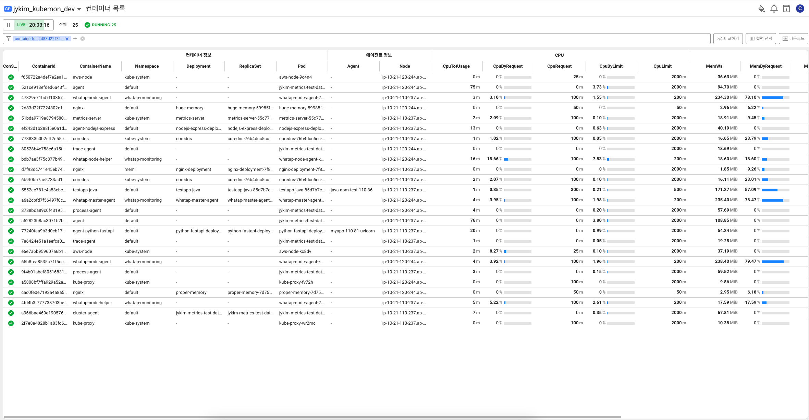

# CLI와 모니터링을 통한 오브젝트 확인

## [와탭모니터링] 컨테이너맵 - Pod

```shell
kubectl get pods
```


컨테이너맵 - 파드 카테고리

## [와탭모니터링] 컨테이너맵 - 네임스페이스, 리플리카셋, 디플로디먼트 그룹화

```shell
kubectl get pods -A
```


컨테이너맵 - 네임스페이스 그룹화

## [와탭모니터링] 컨테이너맵 - 대상정보, 이벤트, 로그

```shell
kubectl describe pod {podName}
```


파드 이벤트

```shell
kubectl logs pod {podName}
```


컨테이너 로그

## 쿠버네티스 구조





### 마스터 노드

- **제어 선박**
- 화물선을 모니터링하고 관리하는 역할을 담당
    - 컨테이너를 싣는 방법 계획
    - 올바른 선박 식별
    - 선박에 대한 정보 저장
    - 선박 내의 컨테이너 위치를 모니터링하고 추적
    - 전체 로드 프로세스 등을 관리
- 마스터 노드에서는 컨테이너를 실행하지는 않고, 워커노드에서 실행되는 컨테이너를 관리하는 역할

### 워커 노드

- **화물선**
- 컨테이너를 바다 건너편으로 운반하는 실제 작업을 수행
- 컨테이너를 실행할 수 있는 소프트웨어 엔진(컨테이너 런타임 엔진) 필요 (ex. 도커)

## 와탭 에이전트가 하는 일

### 마스터 에이전트와 노드 에이전트

- 사용자의 클러스터 내에서 파드 형태로 실행
- 메타 정보와 각 노드의 성능 정보 수집



## [와탭모니터링] 컨테이너맵 - Container



## 컨테이너와 파드의 차이

### 컨테이너란?

- 애플리케이션과 필요한 모든 파일을 하나의 런타임 환경으로 묶는데 사용하는 기술
- 이를 통해 전체 기능을 유지하면서 컨테이너화된 애플리케이션을 환경 간에 쉽게 이동할 수 있다.

### 파드란?

- 쿠버네티스에서 생성하고 관리할 수 있는 배포 가능한 가장 작은 컴퓨팅 단위
- 하나 이상의 컨테이너 묶음
- 따라서 쿠버네티스에서는 컨테이너 단위로 정보를 얻을 수 없다.
- 하지만 와탭은 가능하다.

## [와탭모니터링] 컨테이너맵 - 컨테이너 정보, 노드상세, 컨테이너 목록



컨테이너맵 - 컨테이너 블록 선택



컨테이너 정보



노드 상세



컨테이너 목록