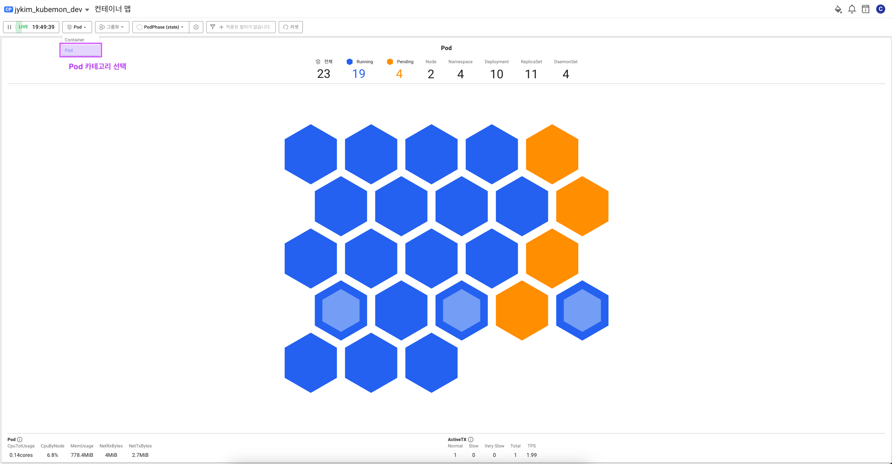
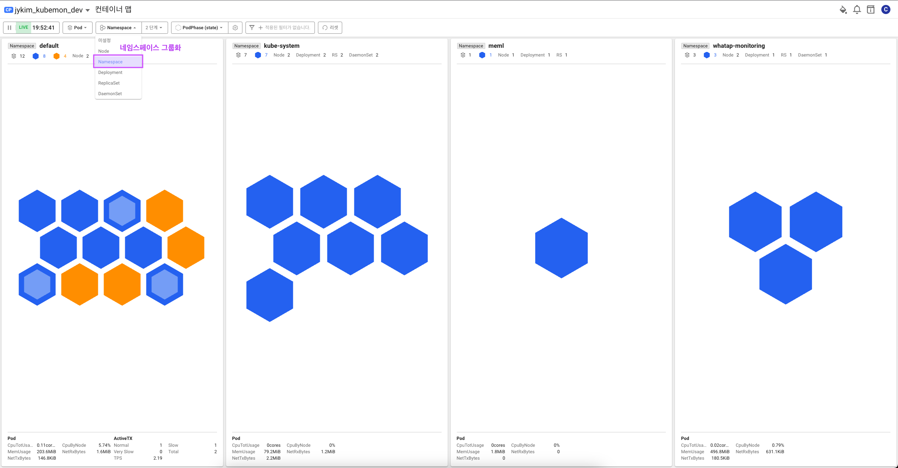
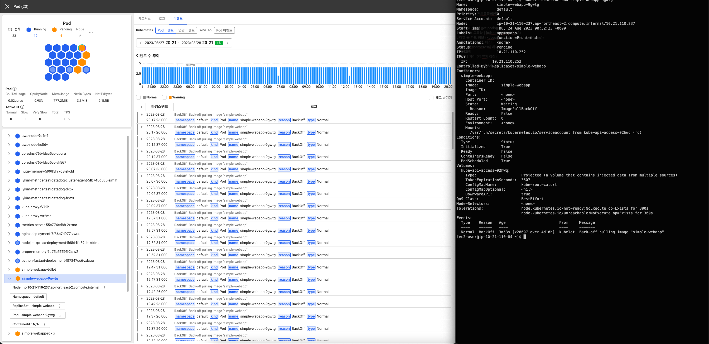
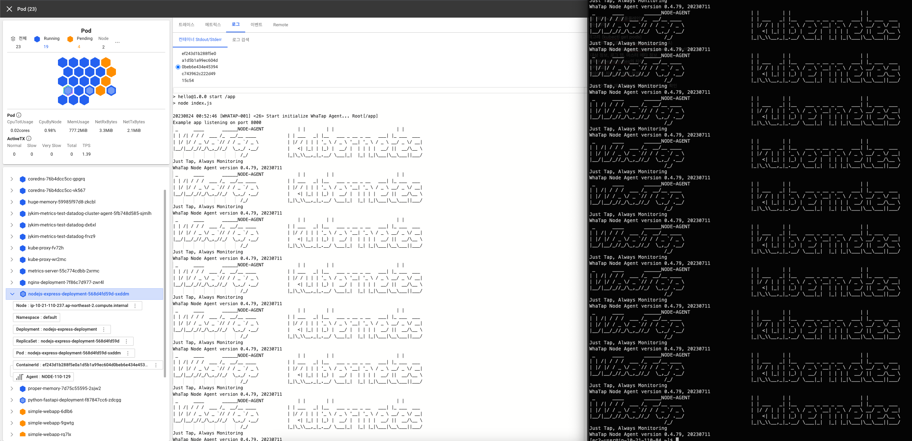

# 파드 중심으로 본 컨테이너맵

## Pod 카테고리 선택하기

```shell
kubectl get pods
```



컨테이너맵 - 파드 카테고리

## 네임스페이스, 리플리카셋, 디플로디먼트 그룹화 하기

```shell
kubectl get pods -A
```



컨테이너맵 - 네임스페이스 그룹화

## 대상정보, 이벤트, 로그 확인하기

```shell
kubectl describe pod {POD_NAME}
```



파드 이벤트

```shell
kubectl logs pod {POD_NAME}
```



컨테이너 로그