# 2부: 쿠버네티스 모니터링 실습


## 쿠버네티스 모니터링이 필요한 이유
쿠버네티스 클러스터 안에는 많은 서비스가 독립적으로 운영되기 때문에, 이를 효과적으로 모니터링하고 로그를 관리하는 것이 중요합니다. 이를 위해 쿠버네티스는 클러스터의 상태와 관리를 위한 기본적인 리소스 모니터링 기능을 제공합니다. 그러나 쿠버네티스 만으로는 다음과 같은 요구사항을 충족시키기는 어렵습니다.

- 시각화와 대시보드
- 실시간 트래픽 모니터링, 로그 분석, 트레이싱과 같은 고급 모니터링 기능
- 알림과 경고
- 대규모 애플리케이션 환경을 위한 로그 관리

따라서 실제 운영 환경에서는 이런 요구사항을 충족할 수 있는 모니터링 솔루션을 도입해 보다 체계적이고 전문적인 모니터링 환경을 구축합니다.

:::info 이번 실습에서는 다음과 같은 활동을 합니다.

1. 명령어 없이 시각적으로 이전에 생성한 리소스를 살펴봅니다.
2. 실제 java 웹 애플리케이션을 배포합니다.
3. 다양한 부하 상황을 만들어보고, 이를 모니터링합니다.
:::

## 모니터링 설치하기

### 회원 가입 및 로그인

와탭 서비스에 접속해 회원 가입 및 로그인을 진행하세요. 

[WhaTap](https://service.whatap.io/account/login)

### 계정 언어 설정 변경

한국어 지원을 빼놓을 순 없겠죠. 와탭 모니터링 계정의 언어 설정을 변경합니다.
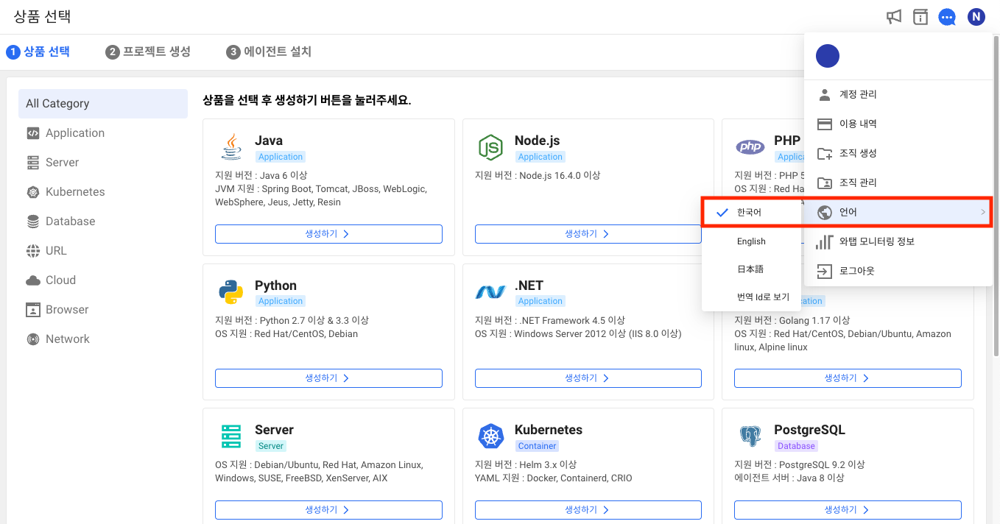

### 쿠버네티스 모니터링 프로젝트 생성

모니터링을 설치하기 전에 와탭 서비스에서 쿠버네티스 모니터링을 위한 프로젝트를 생성합니다.

1. 상품 선택 단계에서 Kubernetes를 선택하세요.
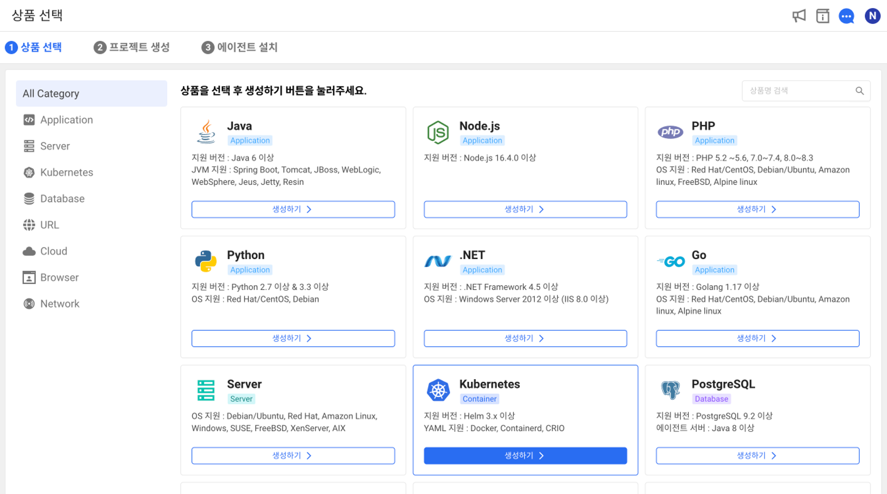
2. 프로젝트 생성 단계에서 프로젝트 정보를 입력해주세요.
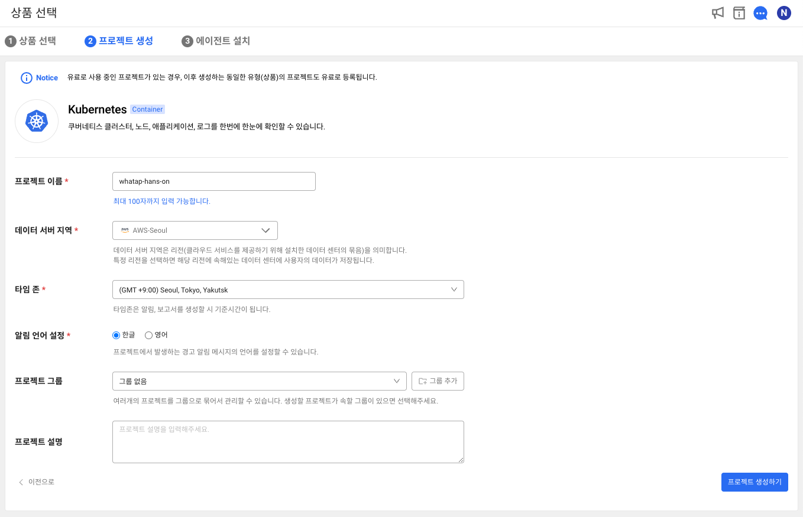
>   프로젝트 이름 : (자율)  
>   데이터 서버 지역 : Korea-AWS-Seoul  
>   타임 존 : (GMT +9:00) Seoul, Tokyo, Yakutsk  


### 쿠버네티스 에이전트 설치

프로젝트 생성이 완료되면, 쿠버네티스 에이전트 설치 화면으로 이동합니다.

1. 쿠버네티스 모니터링 프로젝트에 대한 액세스 키를 발급받고 다음을 누릅니다.

   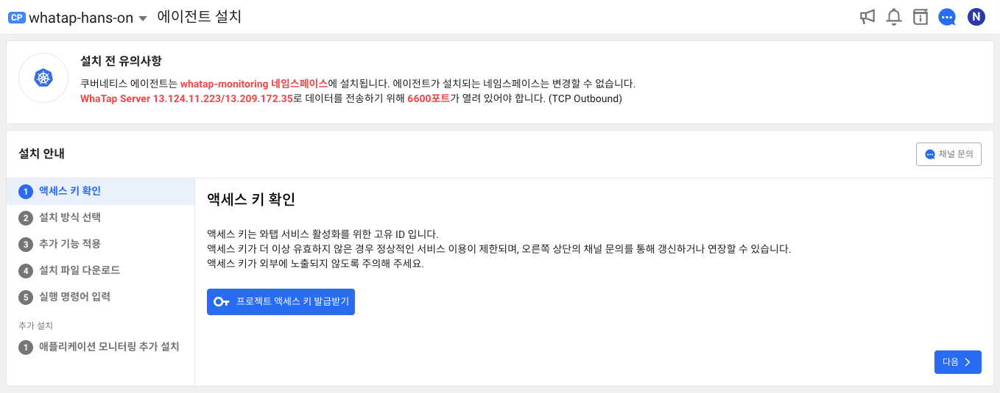

2. 아래 이미지와 같이 옵션을 선택해주세요.

   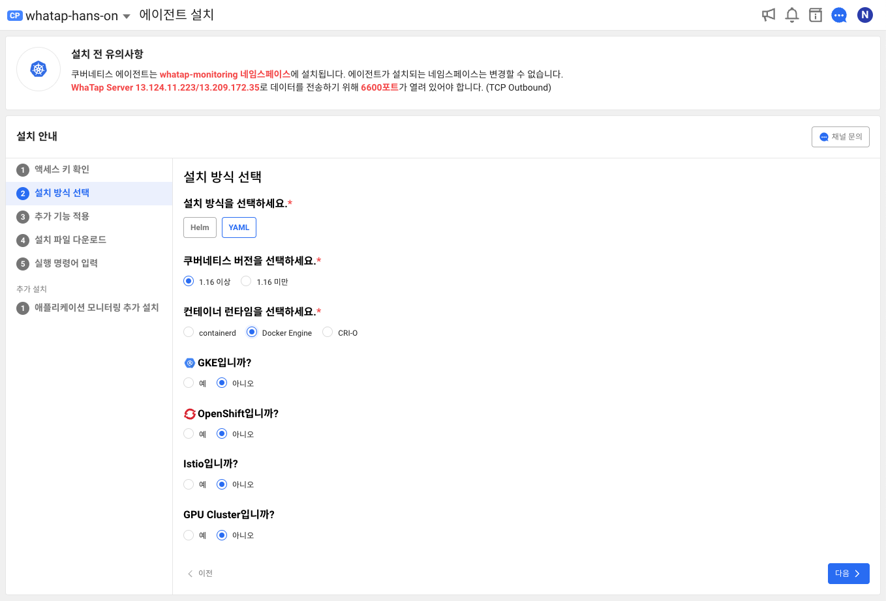

3. 추가 기능은 사용하지 않으므로 다음으로 넘어갑니다.

   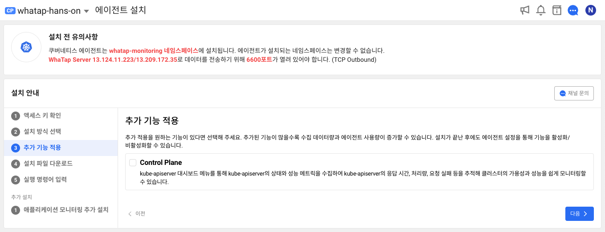

4. 설치 파일을 다운로드 받고 다음을 누릅니다.

   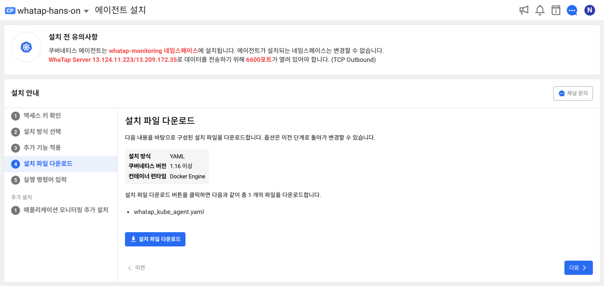

5. 설치 가이드에 안내된 명령어를 복사/붙여넣기하여 실행합니다. 아래 그림과 같이 나오면 성공적으로 설치를 마친 것 입니다.

   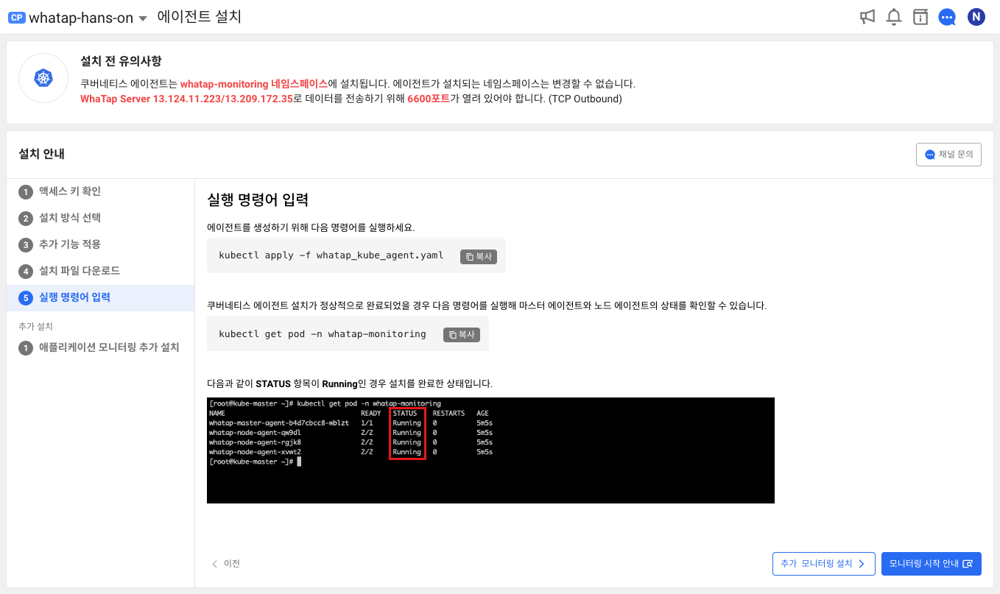

:::tip 다운로드 파일은 기본적으로 아래 위치에 있습니다.  
windows - `C:\Users\{사용자이름}\Downloads\whatap_kube_agent.yaml`  
macOS - `/Users/{사용자이름}/Downloads/whatap_kube_agent.yaml`  
windows, macOS 모두 경로 이동 시 `cd` 명령을 사용하여 이동합니다.
:::


### 로그 모니터링 활성화

1. 좌측 사이드바의 로그 > 로그 설정 메뉴로 들어갑니다.
2. 에이전트 설정 확인 단계에서 로그 설정 적용하기 버튼을 클릭해 로그 수집을 활성화해주세요.

   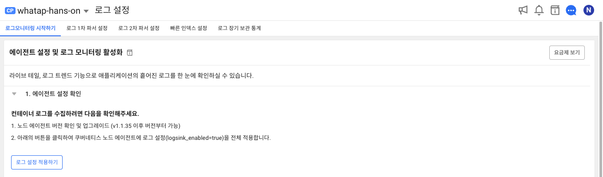

   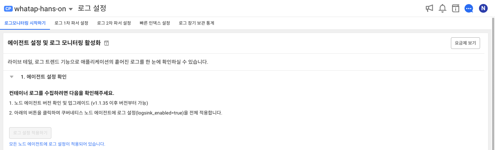

3. 로그 모니터링 활성화 단계에서 로그 모니터링을 활성화 해주세요.

   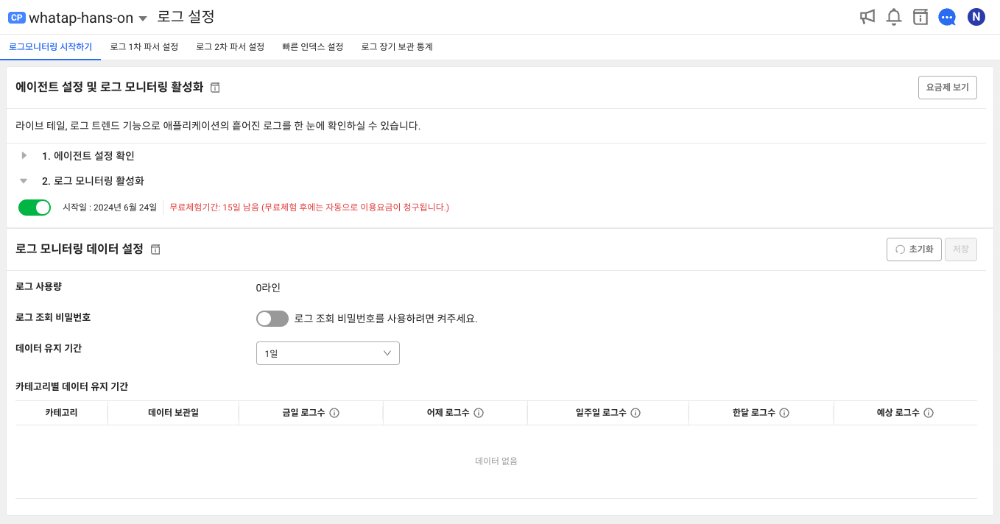


### 모니터링 설치 확인

1. 대시보드 > 컨테이너 맵 메뉴에서 다음과 같이 오브젝트가 관찰된다면 모니터링이 잘 설치된 것입니다.

   <컨테이너 맵 짧은 설명>

   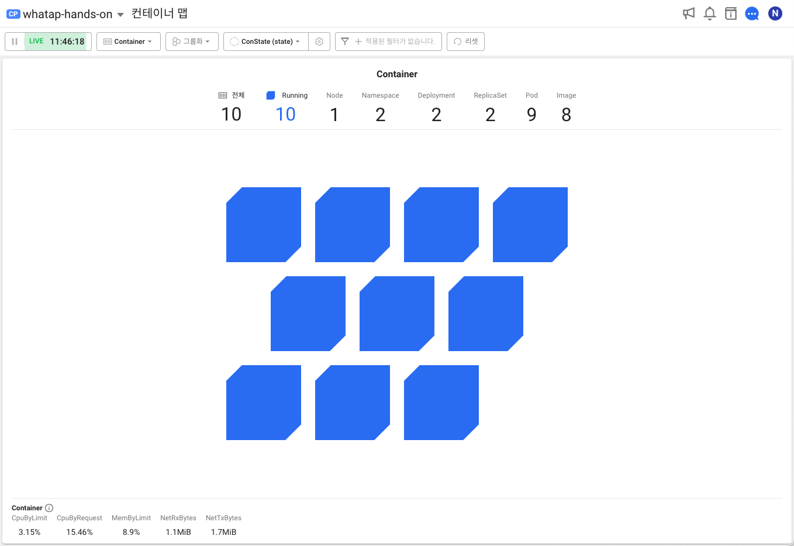

2. 상단의 그룹화 옵션을 Namespace로 선택하면 쿠버네티스 모니터링을 하는 와탭 에이전트 컨테이너가 whatap-monitoring이라는 네임스페이스로 분리된 것을 확인할 수 있습니다.

   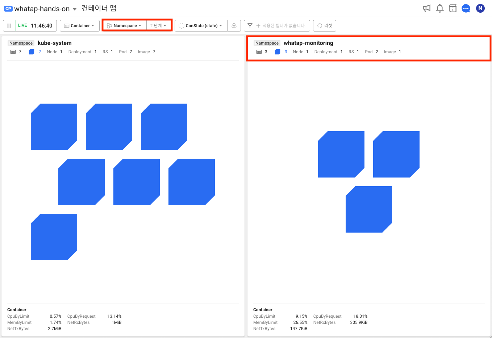


## 애플리케이션 배포하기

1. 메모장을 준비합니다.
2. 관리 > 프로젝트 관리 메뉴로 이동한 뒤, 프로젝트 액세스 키를 메모장에 복사해주세요.

   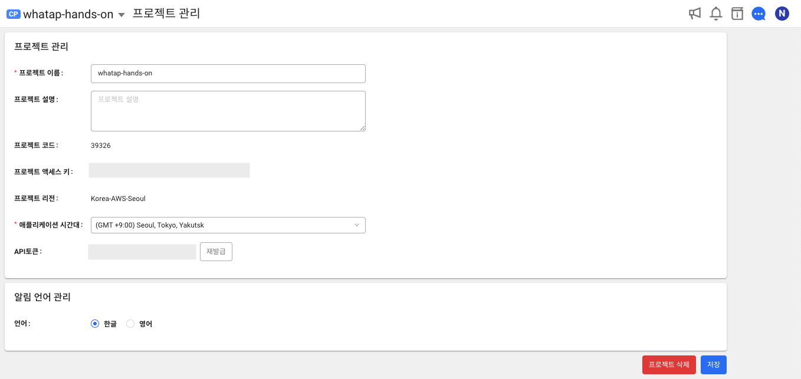

3. 다음 명령어를 메모장에 복사해주세요.

   > macOS는 다음 명령어를 실행하세요.
   >
   >
   > ```bash
    > curl -O https://raw.githubusercontent.com/whatap/k8s-edu-storage/master/k8s-object/hands-on-labs.yaml && sed -i '' 's/\${{LICENSEVALUE}}/이곳에프로젝트액세스키를넣어주세요/g' hands-on-labs.yaml && kubectl apply -f hands-on-labs.yaml
    > ```
   >

   > Windows는 다음 명령어를 실행하세요.
   >
   >
   > ```bash
    > Invoke-WebRequest -Uri "https://raw.githubusercontent.com/whatap/k8s-edu-storage/master/k8s-object/hands-on-labs.yaml" -OutFile "hands-on-labs.yaml"; (Get-Content -Path "hands-on-labs.yaml") -replace '\${{LICENSEVALUE}}', '이곳에프로젝트액세스키를넣어주세요' | Set-Content -Path "hands-on-labs.yaml"; kubectl apply -f hands-on-labs.yaml
    > ```
>
4. `이곳에프로젝트액세스키를넣어주세요` 부분을 이전에 복사해둔 프로젝트 액세스 키로 수정한 뒤 명령어를 실행합니다.

   

   방금 적용한 yaml 파일은 실제론 다음과 같이 생겼습니다. 링크를 통해서도 확인할 수 있습니다.

<details>
    <summary>YAML 전체보기</summary>

    apiVersion: v1
    kind: Namespace
    metadata:
      name: java
    ---
    apiVersion: apps/v1
    kind: Deployment
    metadata:
      name: callee-with-db-deploy
      namespace: java
    spec:
      replicas: 1
      selector:
        matchLabels:
          app: callee-with-db
      template:
        metadata:
          labels:
            app: callee-with-db
        spec:
          containers:
          - name: callee-with-db
            image: workirostub/demo:callee-with-db-1.0.9
            ports:
            - containerPort: 8080
            env:
            - name: JAVA_OPTION
              value: "-Dspring.profiles.active=prod"
            - name: DATASOURCE_URL
              value: "jdbc:postgresql://db-svc.java:5432/postgres"
            - name: DATASOURCE_USERNAME
              value: postgres
            - name: DATASOURCE_PASSWORD
              value: qwer1234
            - name: whatap.server.host
              value: "13.124.11.223/13.209.172.35"
            - name: whatap.micro.enabled
              value: "true"
            - name: weaving
              value: "spring-boot-3.0"
            - name: mtrace_rate
              value: "100"
            - name: mtrace_auto_enabled
              value: "false"
            - name: logsink_rt_enabled
              value: "true"
            - name: logsink_enabled
              value: "true"
            - name: NODE_IP
              valueFrom: {fieldRef: {fieldPath: status.hostIP}}
            - name: NODE_NAME
              valueFrom: {fieldRef: {fieldPath: spec.nodeName}}
            - name: POD_NAME
              valueFrom: {fieldRef: {fieldPath: metadata.name}}
            - name: OKIND
              value: hands-on-labs
            - name: license
              value: ${{LICENSEVALUE}}
    ---
    apiVersion: v1
    kind: Service
    metadata:
      name: callee-with-db-svc
      namespace: java
    spec:
      selector:
        app: callee-with-db
      ports:
        - protocol: TCP
          port: 8080
          targetPort: 8080
    ---
    apiVersion: apps/v1
    kind: Deployment
    metadata:
      name: callee-deploy
      namespace: java
    spec:
      replicas: 1
      selector:
        matchLabels:
          app: callee
      template:
        metadata:
          labels:
            app: callee
        spec:
          containers:
          - name: callee
            image: workirostub/demo:callee-1.0.9
            ports:
            - containerPort: 8080
            env:
            - name: JAVA_OPTION
              value: "-Dspring.profiles.active=prod"
            - name: CALLEE_WITH_DB_URL
              value: http://callee-with-db-svc.java:8080
            - name: whatap.server.host
              value: "13.124.11.223/13.209.172.35"
            - name: whatap.micro.enabled
              value: "true"
            - name: weaving
              value: "spring-boot-3.0"
            - name: mtrace_rate
              value: "100"
            - name: mtrace_auto_enabled
              value: "false"
            - name: logsink_rt_enabled
              value: "true"
            - name: logsink_enabled
              value: "true"
            - name: NODE_IP
              valueFrom: {fieldRef: {fieldPath: status.hostIP}}
            - name: NODE_NAME
              valueFrom: {fieldRef: {fieldPath: spec.nodeName}}
            - name: POD_NAME
              valueFrom: {fieldRef: {fieldPath: metadata.name}}
            - name: OKIND
              value: hands-on-labs
            - name: license
              value: ${{LICENSEVALUE}}
    ---
    apiVersion: v1
    kind: Service
    metadata:
      name: callee-svc
      namespace: java
    spec:
      selector:
        app: callee
      ports:
        - protocol: TCP
          port: 8080
          targetPort: 8080
    ---
    apiVersion: apps/v1
    kind: Deployment
    metadata:
      name: caller-deploy
      namespace: java
    spec:
      replicas: 1
      selector:
        matchLabels:
          app: caller
      template:
        metadata:
          labels:
            app: caller
        spec:
          containers:
          - name: caller
            image: workirostub/demo:caller-1.0.9
            ports:
            - containerPort: 8080
            env:
            - name: JAVA_OPTION
              value: "-Dspring.profiles.active=prod"
            - name: CALLEE_URL
              value: http://callee-svc.java:8080
            - name: whatap.server.host
              value: "13.124.11.223/13.209.172.35"
            - name: whatap.micro.enabled
              value: "true"
            - name: weaving
              value: "spring-boot-3.0"
            - name: mtrace_rate
              value: "100"
            - name: mtrace_auto_enabled
              value: "false"
            - name: logsink_rt_enabled
              value: "true"
            - name: logsink_enabled
              value: "true"
            - name: NODE_IP
              valueFrom: {fieldRef: {fieldPath: status.hostIP}}
            - name: NODE_NAME
              valueFrom: {fieldRef: {fieldPath: spec.nodeName}}
            - name: POD_NAME
              valueFrom: {fieldRef: {fieldPath: metadata.name}}
            - name: OKIND
              value: hands-on-labs
            - name: license
              value: ${{LICENSEVALUE}}
    ---
    apiVersion: v1
    kind: Service
    metadata:
      name: caller-svc
      namespace: java
    spec:
      type: NodePort
      selector:
        app: caller
      ports:
        - protocol: TCP
          port: 8080
          targetPort: 8080
          nodePort: 32100
    ---
    apiVersion: v1
    kind: Pod
    metadata:
      name: postgres
      namespace: java
      labels:
        app: db
    spec:
      restartPolicy: Always
      containers:
      - name: postgres
        image: postgres:12
        ports:
        - containerPort: 5432
        env:
        - name: POSTGRES_PASSWORD
          value: qwer1234
        - name: PGDATA
          value: /var/lib/postgresql/data/pgdata
      volumes:
        - name: data
          emptyDir:
            sizeLimit: 100Mi
    ---
    apiVersion: v1
    kind: Service
    metadata:
      name: db-svc
      namespace: java
    spec:
      selector:
        app: db
      ports:
        - protocol: TCP
          port: 5432
          targetPort: 5432
</details>

:::info
    🔗 https://raw.githubusercontent.com/whatap/k8s-edu-storage/master/k8s-object/hands-on-labs.yaml
:::

5. 대시보드 > 애플리케이션 서비스 대시보드 메뉴에 들어가 애플리케이션 데이터가 수집되고 있는지 확인하세요.

   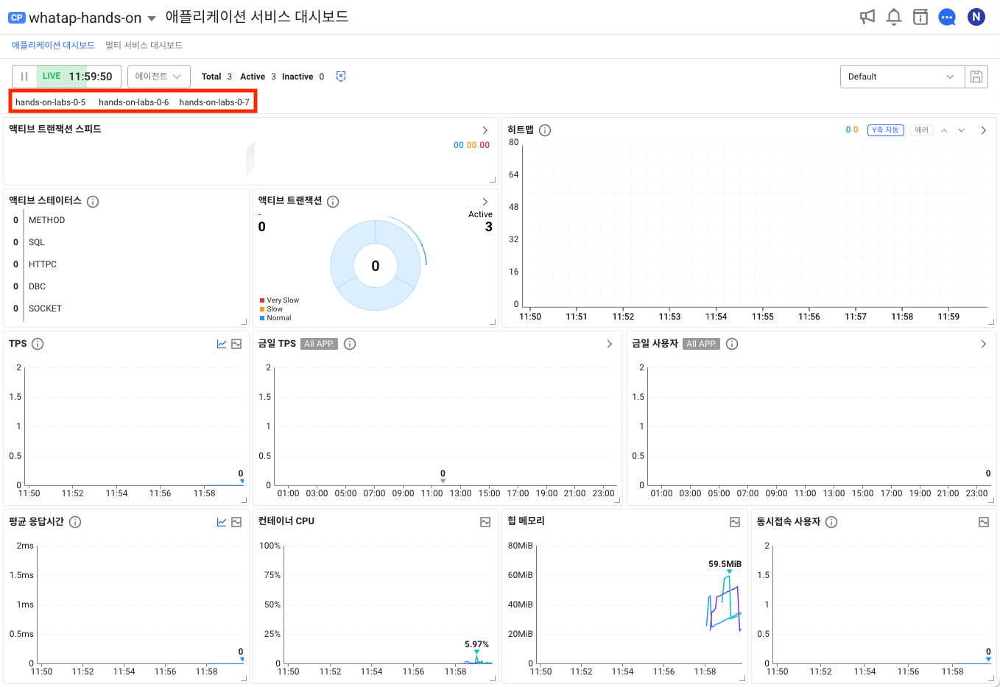

6. 다음 명령어를 실행하여 minikube 컨테이너 밖으로 서비스를 노출합니다. (이 명령을 실행 후 터미널이나 쉘을 닫지마세요!)

    ```bash
    minikube service -n java caller-svc --url
    ```

   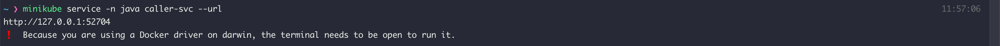

7. Chrome 에서 위 명령을 쳐서 나온 출력 주소를 입력하여 접속합니다. 아래와 같은 화면이 나온다면 정상적으로 애플리케이션이 배포 된 것입니다.

   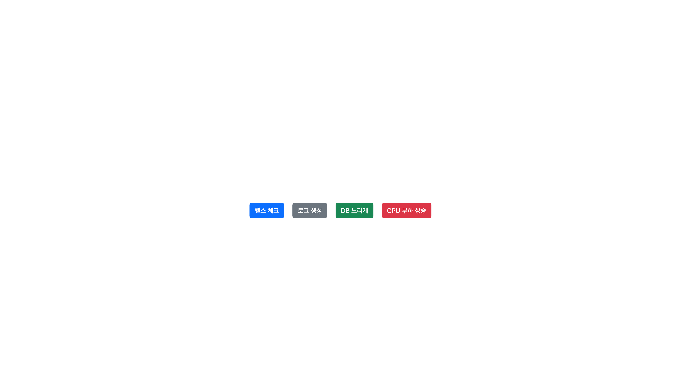


## 애플리케이션 살펴보기

현재 서비스는 3개의 애플리케이션과 1개의 DB로 구성되어있습니다.

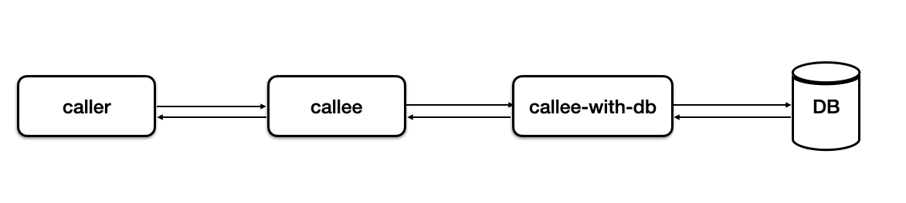

각 애플리케이션의 역할은 다음과 같습니다.

| 애플리케이션 | 역할 |
| --- | --- |
| caller | callee를 호출하는 애플리케이션입니다. 유저가 접속한 화면은 caller가 서빙한 화면입니다. |
| callee | caller로부터 호출 받으며, callee-with-db를 호출하는 애플리케이션입니다. callee는 자체적으로 로직을 가지고 있습니다. |
| callee-with-db | callee로부터 호출 받는 애플리케이션입니다. 데이터베이스 접근에 필요한 로직을 수행합니다. |

쿠버네티스에 배포된 애플리케이션과 사용자의 컴퓨터(인프라)까지의 구조도는 다음과 같습니다.

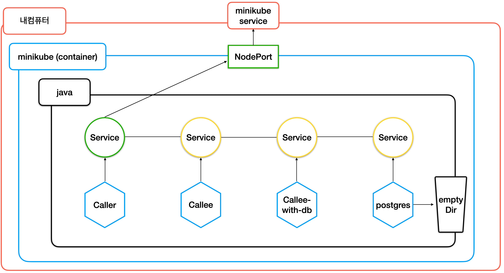

### 실제로 배포한 오브젝트의 관계를 파악해봅시다

`컨테이너 맵 > java 네임스페이스 그룹 선택 > 상세 보기 > 리소스 관계 선택`

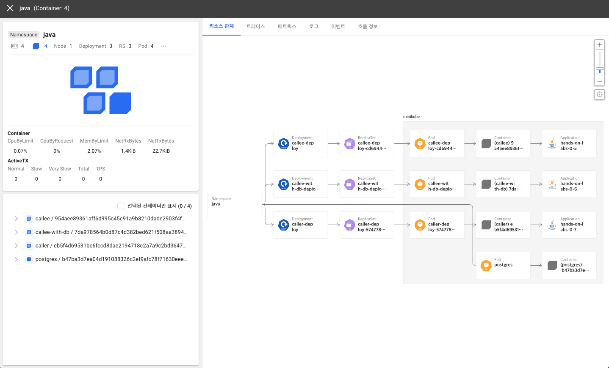

### Pod의 수를 증가시켜 봅시다

Deployment를 수정하여 Pod 수를 증가시켜봅니다. `scale` 은 명령형 방식으로 Deployment, ReplicaSet 등의 사이즈를 설정합니다. `--replicas` 옵션을 통해 사이즈를 지정합니다.

다음 명령어를 실행한 뒤, 컨테이너 맵에서 Deployment를 기준으로 그룹핑하여 살펴봅시다. 무엇이 달라졌을까요?

```bash
kubectl scale -n java deploy/caller-deploy --replicas=3
```

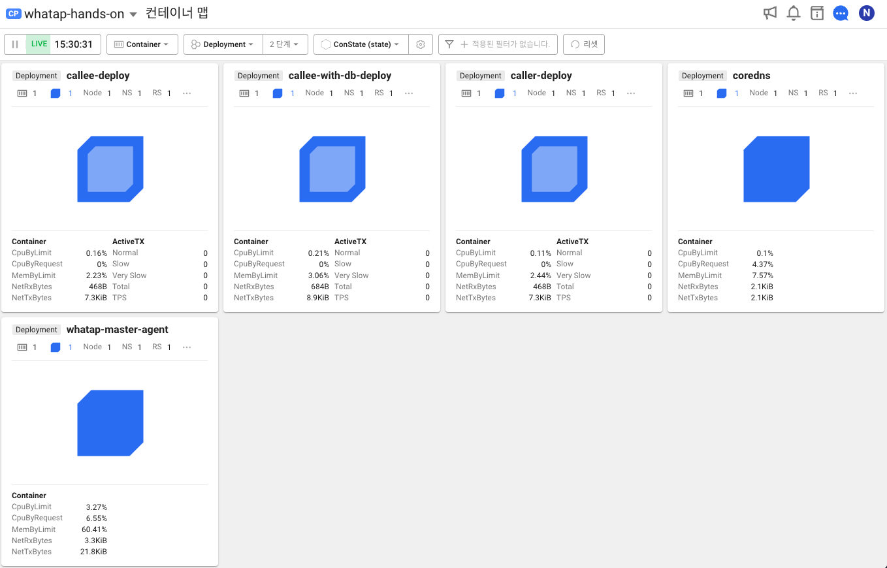

before

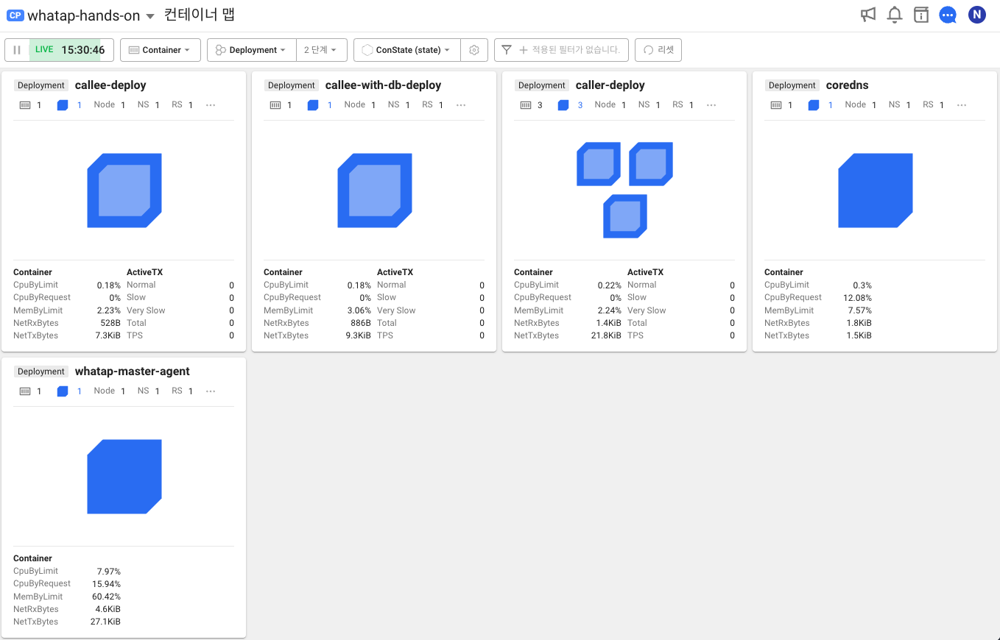

after

### 애플리케이션에 이벤트를 발생시켜봅시다

#### 각 기능 살펴보기

|   기능   |                 설명                      |
| --- | --- |
| 헬스 체크 | caller가 callee의 상태를 체크하는 api를 호출합니다.  |
| 로그 생성 | caller가 callee를, callee가 callee-with-db의 로그 생성 api를 호출합니다. |
| DB 느리게 | caller → callee → callee-with-db 순으로 호출하며 callee-with-db에서 트랜잭션이 매우 느리게 진행됩니다. |
| CPU 부하 상승 | caller → callee 순으로 호출하며 callee에서 무거운 연산이 오랫동안 진행됩니다. |

### 헬스 체크 버튼을 눌러 이벤트를 발생시켜봅시다

- Pod의 트레이스엔 어떤 일이 발생하나요?
    1. 히트맵에 수행된 트랜잭션이 표시됩니다. 해당 트랜잭션들을 드래그해 상세 내용을 살펴볼까요?

       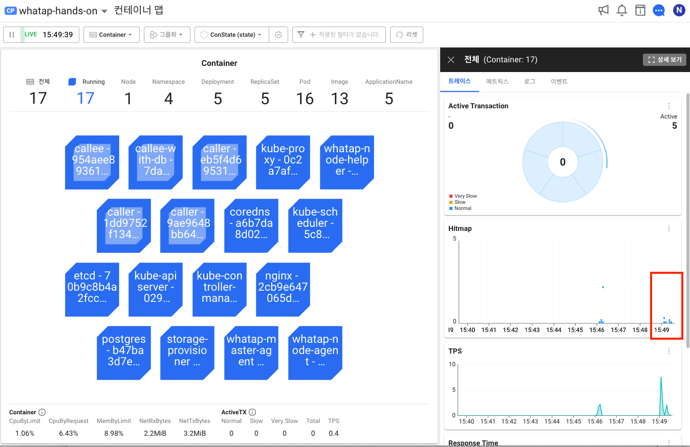

    :::tip **히트맵, 트랜잭션이 무엇인가요?**

       사용자의 요청, 한건 한건을 Request라고 하고, 이 Request를 서버에서 처리하고 사용자에게 응답하는 과정을 **트랜잭션**(**Transaction**)이라고 정의합니다. 트랜잭션을 종료한 시간마다 사용자의 요청에 대한 응답 시간을 차트 위에 사각형으로 표현합니다. 이를 통해 사용자의 요청에 정상적으로 응답했는지 파악할 수 있습니다.

       히트맵 패턴을 통해 장애를 분석하는 방법은 [다음 문서](https://docs.whatap.io/best-practice-guides/about-apm-hitmap-class)에서 자세하게 확인할 수 있습니다.
    :::

    2. 드래그한 구간에서 발생한 모든 트랜잭션 목록 창이 뜨는 것을 확인할 수 있습니다. M표시가 붙어있는 트랜잭션은 다른 애플리케이션과 연계된 트랜잭션(멀티 트랜잭션)을 의미합니다.

       /health 트랜잭션을 클릭한 뒤, 멀티 트랜잭션 탭을 들어가보면 /health가 /callee/health를 호출하고 있는걸 볼 수 있습니다.

       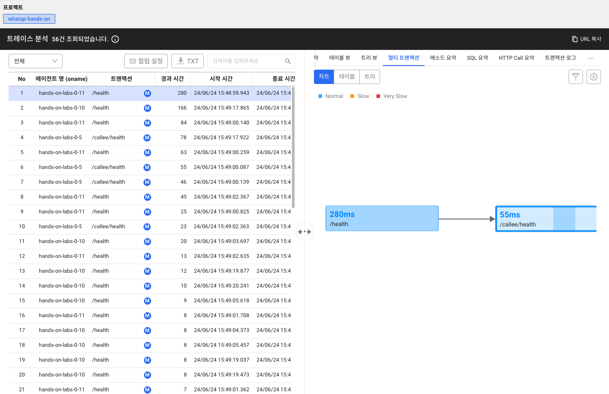

    3. /callee/health 노드를 클릭해보면 해당 트랜잭션의 상세를 확인할 수 있습니다. 트랜잭션 로그를 확인해볼까요?

       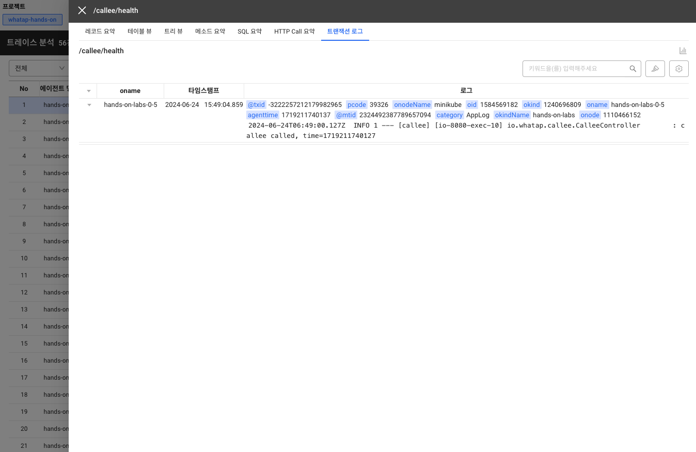

       callee가 호출되었다는 로그가 남아있네요!


### 로그 생성 버튼을 눌러 이벤트를 발생시켜봅니다

- Pod의 트레이스엔 어떤 일이 발생하나요?
    1. 이전과 마찬가지로 멀티 트랜잭션을 확인해보겠습니다. 이번에는 /log → /callee/log → /log/create → DB 까지의 호출이 일어난 것을 확인할 수 있습니다.

       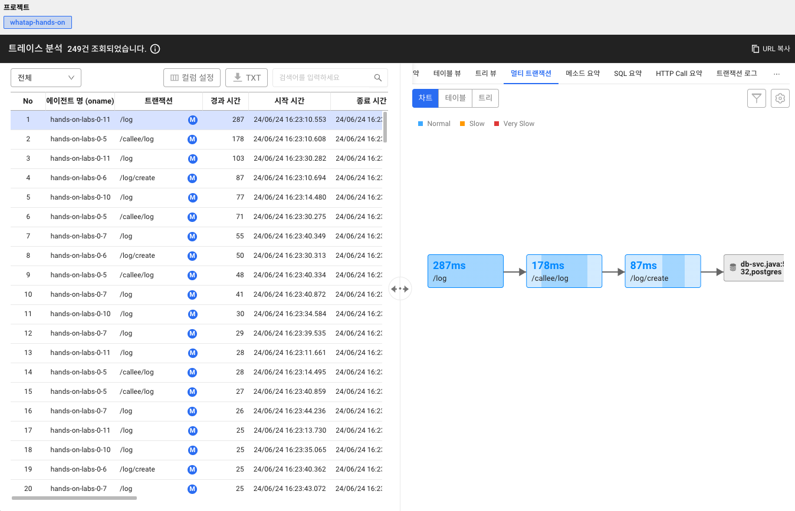

    2. /log/create 트랜잭션 상세를 확인해볼까요?

       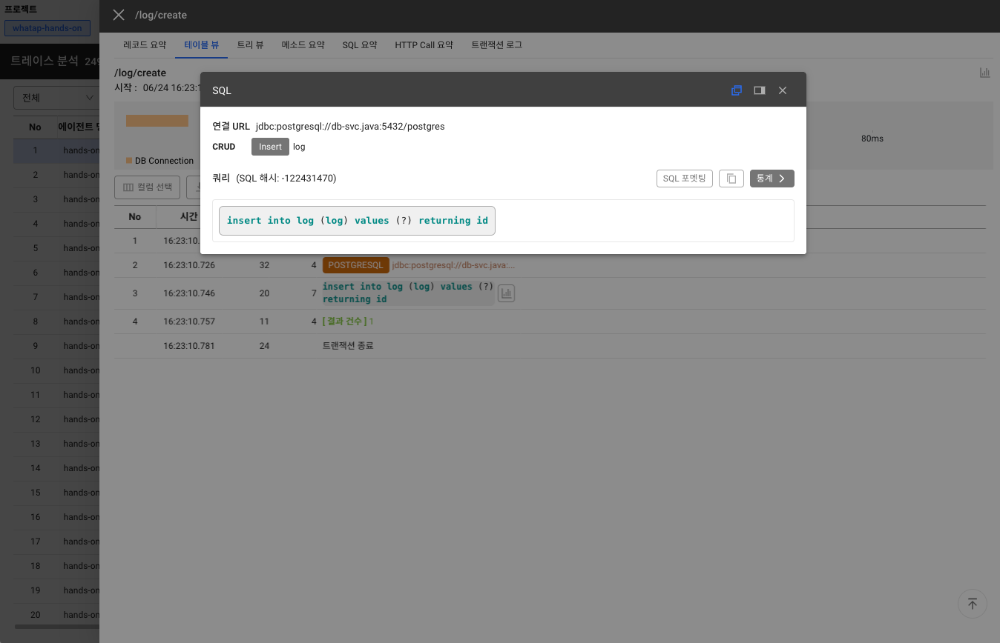

       DB에 로그가 추가되었네요!

- Pod의 로그엔 어떤 일이 발생하나요?

  무슨 로그를 봐야하는지 몰으겟음..


### DB의 느린 조회 발생

DB 느리게 버튼을 눌러 이벤트를 발생시켜보고 원인을 추적해봅니다.

- Pod의 트레이스엔 어떤 일이 발생하나요?

  액티브 트랜잭션(실행중인 트랜잭션)의 수가 늘어나고, 처리 시간 역시 verySlow인 것을 확인할 수 있습니다. 히트맵 역시 이전과는 다르게 노란색, 빨간색 사각형이 위쪽에 분포되어 있네요.

  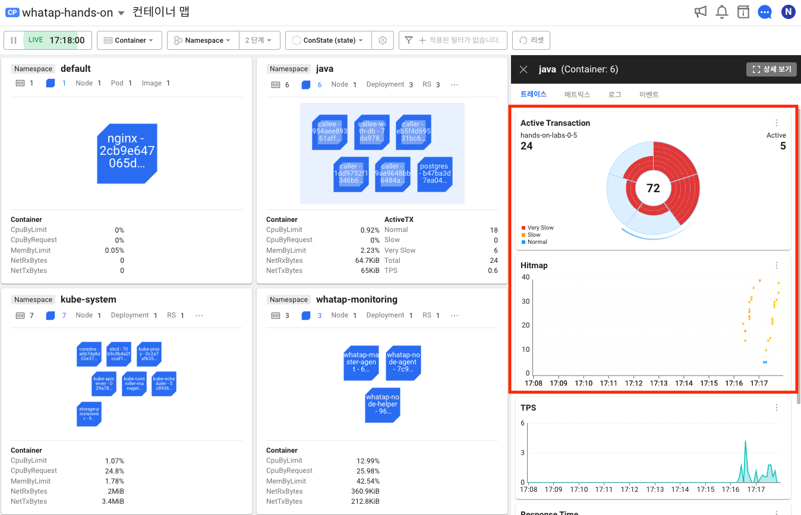

- 왜 느린지 한번 알아보도록 합시다
    1. 이번에는 히트맵이 아닌 액티브 트랜잭션을 클릭하여 원인을 찾아봅시다!

       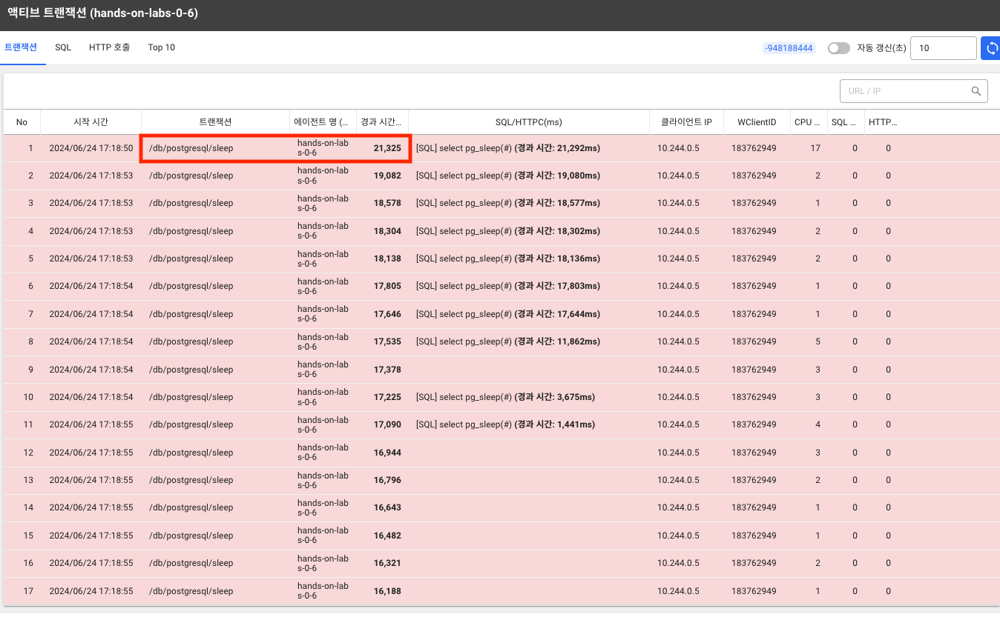

    2. 경과 시간이 가장 긴 트랜잭션 순으로 현재 실행중인 트랜잭션 목록을 확인할 수 있습니다. 가장 상단의 트랜잭션을 클릭해 상세를 확인해보겠습니다.

       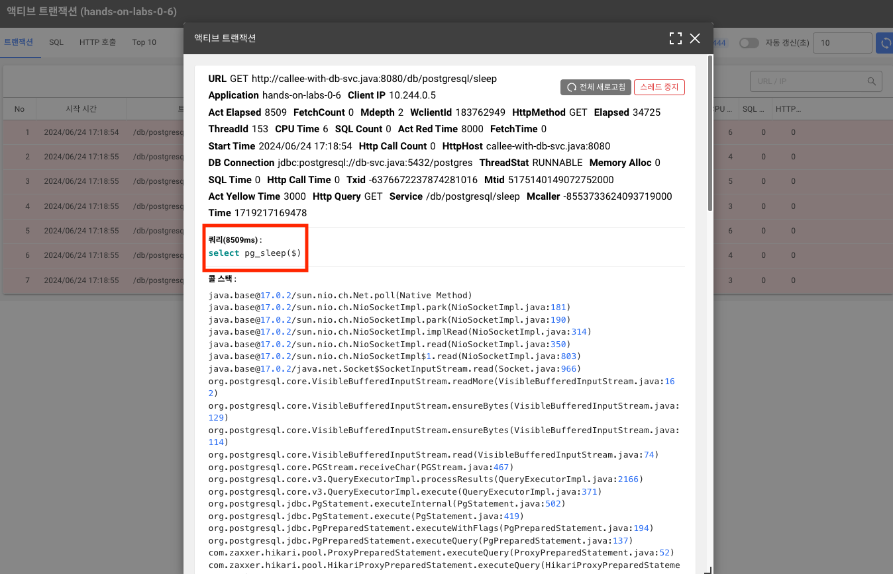

       `SELECT pg_sleep($)` 라는 쿼리를 실행하는데 8.5초나 걸렸네요. 빨리 개발자를 찾아가야겠습니다!


### CPU 부하 발생

CPU 부하 상승 버튼을 눌러 이벤트를 발생시켜보고 원인을 추적해봅니다.

- 왜 CPU의 부하가 상승했을까요?

  몰으겟음…자바 내용 주르륵써있는걸 보면 되나요? 하지만 개발자 아닌 입장에서도 알 수 있는 방법이 있따면,,,어느 요청에 시간이 오래 걸렸는지


## 정말로 모니터링 솔루션이 필요할까?

위에 있는 것들은 직접 쉘로 접근해서 파악할 수 있습니다. 그런데 왜 모니터링 솔루션을 사용하는 걸까요?

- 시각적으로 바로 파악 할 수 있는가?
- 알림을 즉각적으로 받을 수 있는가?
- 쿠버네티스 환경 전반에 대한 관찰력이 있는가?

---

# 마치며

모두 고생하셨습니다. 다음은 사용한 와탭 모니터링의 프로젝트와 컴퓨터 내의 리소스를 정리하는 작업입니다.

## 리소스 정리

### windows

1. 다음 명령어를 실행하여 minikube 컨테이너를 삭제합니다.

    ```bash
    minikube stop & REM stops the VM
    minikube delete & REM deleted the VM
    ```

2. kubernetes 디렉토리를 삭제하여 쿠버네티스 관련 설정 파일을 제거합니다.

   > 경로 1 - C:\users\{user}\.minikube  
   > 경로 2 -  C:\users\{user}\.kube ← 기존에 사용하던 쿠버네티스 환경이 있다면 지우지 마세요!


### macOS

다음 명령어를 실행하여 minikube 컨테이너를 삭제합니다.

```bash
minikube stop
minikube delete
```

## 와탭 모니터링 프로젝트 제거

관리 > 프로젝트 관리 메뉴에서 우측 하단의 프로젝트 삭제 버튼을 클릭하여 프로젝트를 삭제합니다.

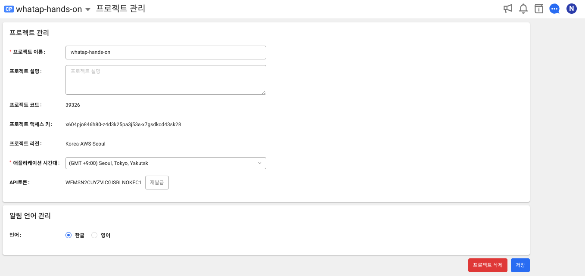

---


