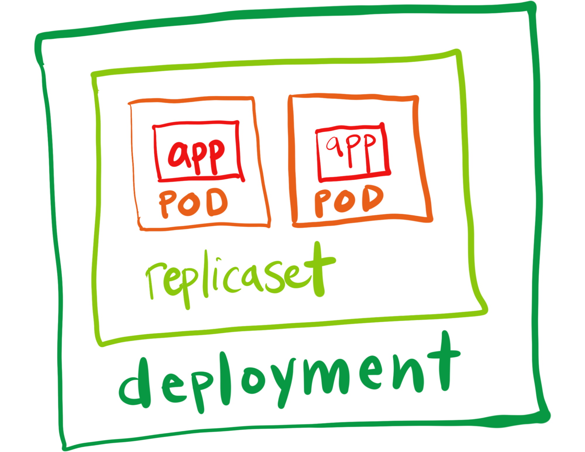
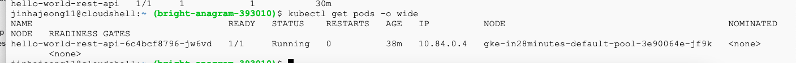
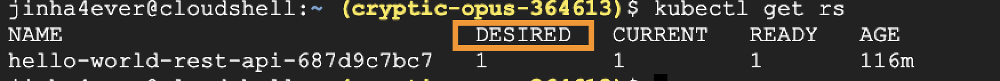
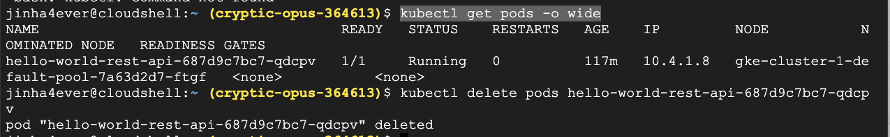
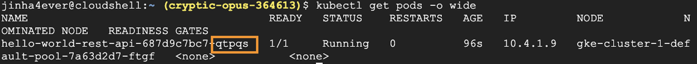
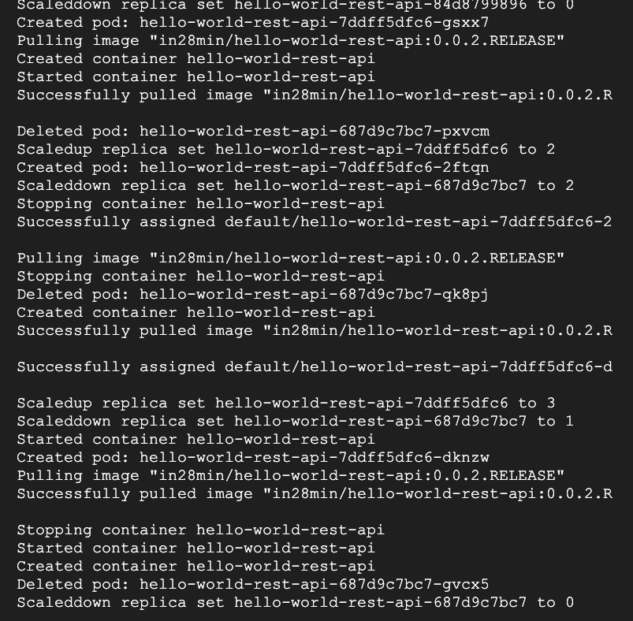
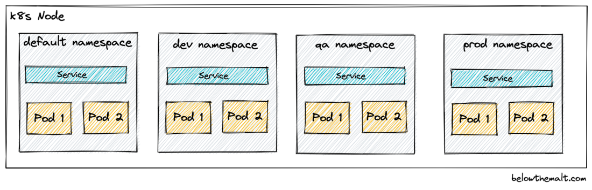
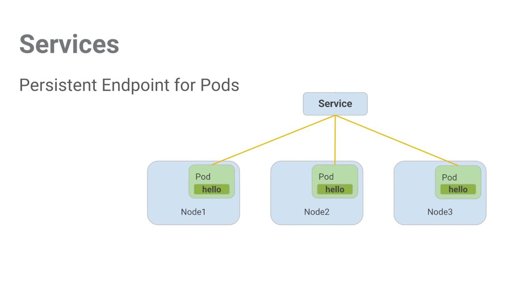

# 쿠버네티스의 주요 오브젝트



이미지 출처 - https://tanzu.vmware.com/developer/guides/knative-serving-wi/

## Pod


이미지 출처 - https://kubernetes.io/docs/tutorials/kubernetes-basics/explore/explore-intro/

- 쿠버네티스에서 가장 작은 배포 가능한 유닛을 파드(Pod)라고 한다.
- 컨테이너를 쿠버네티스에서 배포하고 싶으면 Pod 없이는 할 수 없다.
- 파드는 하나 이상의 컨테이너로 구성된다.
  - 두 개 이상의 컨테이너가 존재하는 경우는 하나의 주 프로그램과 그 프로그램의 보조 역할을 하는 연동되는 관계의 프로그램이 있는 경우가 있을 수 있다.
- `kubectl get pods -o wide` : 쿠버네티스 클러스터 내의 파드 정보 출력하는 명령어
  
  - **각각의 Pod는 유니크 IP 주소를 갖고 있다.**
  - `1/1` : 해당 팟 안에 존재하는 컨테이너의 수와 그 중 몇 개가 READY 상태인지 확인할 수 있다.
  - 파드 안에 존재하는 컨테이너는 리소스를 공유한다.
  - 같은 파드 안에 있는 컨테이너 간에는 `localhost`를 사용하여 서로간에 통신할 수 있다.
- 파드 정의 파일 예시(YAML)
  ```yaml
  apiVersion: v1
  kind: Pod
  metadata:
    name: example-pod
    labels:
      app: example-app
      release: "1.0"
    annotations:
      example.com/documentation-url: "https://docs.example.com/example-app/1.0"
      example.com/deployment-date: "2023-08-28"
  spec:
    containers:
      - name: example-container
        image: example/image:1.0
  ```
- `labels`: 파드를 ReplicaSet이나 Service와 매핑하기 위한 중요한 식별자로 사용된다.
- `annotations`: 선택과 필터링을 위한 것이 아닌, 애플리케이션의 문서 URL이나 파드의 배포 날짜와 같은 부가적인 정보를 기록하기 위해 사용된다.

## ReplicaSet

- 파드의 정해진 특정 수가 항상 실행될 수 있도록 보장하는 역할을 한다.
- 파드에는 자동으로 설정된 개수를 유지하는 기능이 없고, 개수를 유지하는 기능이 필요하면 레플리카 셋 또는 디플로이먼트를 만들어야 한다.
- `kubectl get replicaset` `kubectl get rs`
  
  클러스터 내부의 레플리카 셋을 검색한다.
- `kubectl delete` 명령어를 사용하여 아래의 실행 중인 파드를 삭제한다.
  
- 삭제 후 다시 파드 리스트를 불러오면 파드 이름이 변경된 것을 통해 다른 파드가 실행된 것을 확인할 수 있다.
  
  새롭게 다시 생성된 파드를 확인할 수 있다.
- ReplicaSet은 파드를 항상 모니터링 하고 있다가, 레플리카 셋을 생성할 때 설정한 바람직한 파드의 수보다 더 적은 파드만 존재하면 새롭게 파드를 생성한다.
- 레플리카셋 정의 파일(YAML)
  ```yaml
  apiVersion: apps/v1
  kind: ReplicaSet
  metadata:
    name: example-replicaset
    labels:
      app: example-app
      release: "1.0"
  spec:
    replicas: 3 # 원하는 복제본 수를 여기에 지정**
    selector:
      matchLabels:
        app: example-app #파드의 labels : app과 동일하게 적어준다.
        release: "1.0" #파드의 labels : release와 동일하게 적어준다.
    template: #파드 정의**
      metadata:
        labels:
          app: example-app
          release: "1.0"
        annotations:
          example.com/documentation-url: "https://docs.example.com/example-app/1.0"
          example.com/deployment-date: "2023-08-28"
      spec:
        containers:
          - name: example-container
            image: example/image:1.0
  ```

## Deployment

- ReplicaSet의 상위 개념으로 볼 수 있다.
- 특정 버전(V1)으로 배포된 애플리케이션의 새로운 버전(V2)으로 다운 타임 없이 안정적으로 배포할 수 있다.
- ReplicaSet을 기반으로 하여 애플리케이션의 인스턴스를 여러 노드에 걸쳐 안정적으로 유지 및 실행시킨다.
- 설정한 파드의 수를 유지하기 위해 내부적으로는 ReplicaSet을 사용한다.
- Deployment는 애플리케이션의 롤아웃(소프트웨어나 애플리케이션의 새로운 버전을 점진적으로 배포하는 과정) 및 롤백과 같은 고급 기능을 제공하여 새로운 버전의 애플리케이션을 안정적으로 배포할 수 있다.
  
  롤링 업그레이드 방식으로 V1 → V2로 배포했을 때 확인할 수 있는 로그 메시지
- 디플로이먼트 정의 파일(YAML)
  ```yaml
  apiVersion: apps/v1
  kind: Deployment
  metadata:
    name: example-deployment
    labels:
      app: example-app
      release: "1.0"
  spec:
    replicas: 3 # 원하는 복제본 수를 여기에 지정
    selector:
      matchLabels:
        app: example-app # 파드의 labels : app과 동일하게 적어준다.
        release: "1.0" # 파드의 labels : release와 동일하게 적어준다.
    strategy:
      type: RollingUpdate
      rollingUpdate:
        maxSurge: 1 # 동시에 생성될 수 있는 파드 수
        maxUnavailable: 1 # 업데이트 중 사용할 수 없는 파드의 최대 수
    template: #파드 정의
      metadata:
        labels:
          app: example-app
          release: "1.0"
        annotations:
          example.com/documentation-url: "https://docs.example.com/example-app/1.0"
          example.com/deployment-date: "2023-08-28"
      spec:
        containers:
          - name: example-container
            image: example/image:1.0
  ```

## Namespace



이미지 출처 - https://belowthemalt.com/2022/04/09/kubernetes-namespaces/

- 네임스페이스는 쿠버네티스 클러스터 내의 리소스를 구분하고 격리하는 데 사용되는 쿠버네티스의 오브젝트이다.
- 클러스터 내에서 다른 환경(예: 개발, 테스트)이 공존할 때 네임스페이스를 사용하여 이러한 환경들을 독립적으로 관리할 수 있다.
- 예를 들어, 개발(**`DEV`**) 환경과 품질 보증(**`QA`**) 환경이 동일한 클러스터에서 실행될 때, **`DEV`**와 **`QA`**라는 두 개의 분리된 네임스페이스를 생성할 수 있다.
- 이렇게 생성된 네임스페이스를 사용하면, 각 환경에 해당하는 리소스를 효과적으로 관리하고 분리할 수 있다.

## Service



이미지 출처 - https://www.aquasec.com/cloud-native-academy/kubernetes-101/kubernetes-services/

- 서비스는 파드 셋(Set)을 내외부 트래픽에 노출시키는 역할을 한다.
- 웹 서비스의 여러 인스턴스가 각기 다른 파드에서 동작하더라도 서비스를 사용하면, 이 모든 파드에 대한 단일 DNS 이름과 IP 주소를 갖게 된다.
- 파드들이 종료되거나 새로 생성되더라도, 서비스의 IP 주소와 DNS 이름은 변하지 않는다.
- 서비스 정의 파일 예시(YAML)
  ```yaml
  apiVersion: v1
  kind: Service
  metadata:
    name: example-service
    labels:
      app: example-app
      release: "1.0"
  spec:
    selector: #동일한 엔드포인트를 제공할 파드 선택
      app: example-app
      release: "1.0"
    ports:
      - protocol: TCP
        port: 80 # 서비스가 사용할 포트
        targetPort: 8080 # 파드가 실제로 리스닝하고 있는 포트 (이는 예시이므로 해당 포트에 맞게 조정되어야 한다)
  ```
