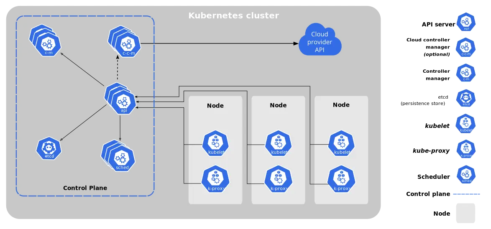
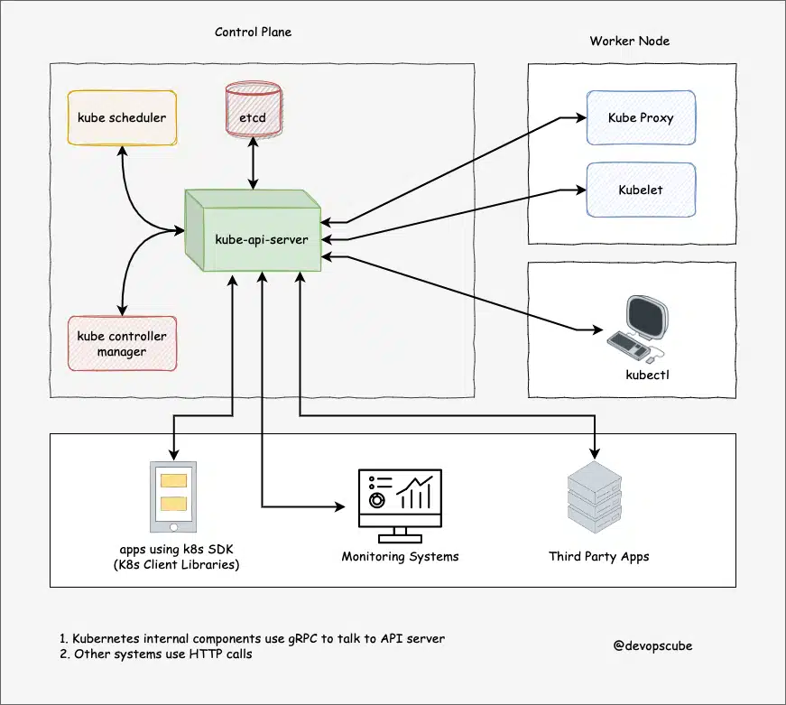
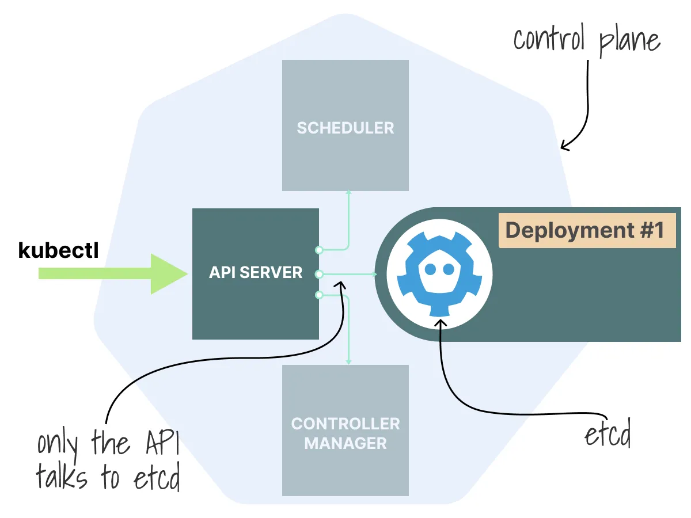
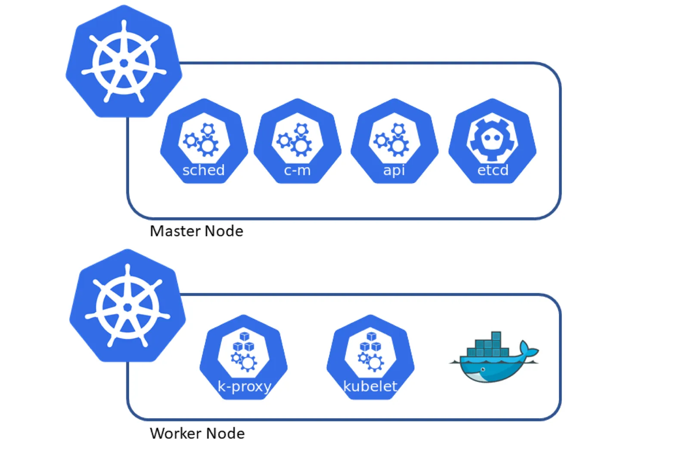

# 쿠버네티스의 구조

출처 - https://devopscube.com/docker-container-clustering-tools/

- 쿠버네티스 클러스터는 컨테이너화된 애플리케이션을 배포, 스케일 및 관리하기 위한 쿠버네티스의 런타임 환경
- 클러스터는 여러 노드로 구성되며, 이러한 노드들은 물리적 또는 가상의 서버들을 나타낸다.
- 클러스터의 관리 및 조정을 담당하는 컨트롤 플레인 노드와 실제 애플리케이션 컨테이너가 실행되는 워커 노드로 나뉜다.

## Control Plane

컨트롤 플레인은 컨테이너 오케스트레이션의 핵심 요소로, 클러스터를 원하는 상태(Desired State)로 지속적으로 유지 및 관리하는 책임을 가진다.

API 서버, etcd, 컨트롤러 매니저, 스케줄러 등의 컴포넌트로 구성되어 있고, 이런 컴포넌트들을 이용하여 클러스터 내의 리소스들을 관리하고 조정한다.

### 1. kube-apiserver

- Kubernetes API를 제공하는 쿠버네티스 클러스터의 지휘관과 같은 역할로 모든 요청과 명령이 이곳을 통해 처리된다.
- 엔드 유저와 다른 클러스터 구성 요소는 API 서버를 통해 클러스터와 상호작용한다.
- 모니터링 도구(와탭, 프로메테우스 등)나 서드 파티 서비스 등도 쿠버네티스 클러스터의 정보를 가져오기 위해 이 API 서버에 접근한다.
- **`kubectl`**을 사용하여 클러스터를 관리할 때, 내부적으로는 HTTP REST API를 통해 kube-apiserver와 통신하게 된다.

https://devopscube.com/kubernetes-architecture-explained/

### 2. etcd

이미지 출처 - https://itnext.io/how-etcd-works-in-kubernetes-e18adf97d24d

- 분산 키-값 데이터베이스로 설계되어 있다.
- 쿠버네티스 클러스터 내의 모든 오브젝트의 상태 정보, 메타데이터 및 설정을 보관한다.
- 클러스터 내의 어떤 변화가 전체 클러스터에 일관되게 반영될 것을 보장한다.
- **`kubectl describe`** 명령어를 사용해 특정 오브젝트의 세부 정보를 조회할 때, 실제로는 etcd에서 해당 정보를 가져온다.

### **3. kube-scheduler**

- 파드를 적절한 워커 노드에 배치하는 책임을 가진 컴포넌트
- 쿠버네티스 클러스터 내의 여러 노드 중, 새로 생성된 파드가 어느 노드에 실행될지 결정한다.
- 파드의 요구사항과 각 노드의 현재 상태를 고려해 최적의 노드를 선택한다.
  - 예를 들면, 파드가 요청하는 CPU와 메모리와 비교하여 노드의 현재 가용 자원을 확인한다.
  - 이미 사용 중인 포트와 충돌하지 않도록 노드의 포트 사용 상태도 고려한다.
- 최종적으로 kube-scheduler는 조건을 만족하는 가장 적절한 노드에 파드를 스케줄링한다.

### 4. Controller Manager

- 클러스터의 상태를 지속적으로 모니터링하여 사용자가 원하는 상태(desired state)와 현재 상태(actual state)의 차이를 감지하고 필요한 조치를 취하여 두 상태를 일치시키는 역할을 수행한다.
  - 예: 애플리케이션 A의 파드 인스턴스가 10개로 유지되어야 한다면, Controller Manager는 이를 확인하고 필요한 경우 조치를 취한다.
  - 예: 릴리즈 2 버전의 인스턴스를 5개 유지해야 한다면, 해당 상태가 유지되고 있는지 확인하고 조정한다.
- 컨트롤러 매니저에는 `kube-controller-manager`와 `cloud-controller-manager`가 있으며 `kube-controller-manager`에는 `Node Controller`, `Replication Controller`, `Endpoints Controller`, `Service Account & Token Controllers`, `Namespace Controller` 등이 있다.
  - 예를들어 `Namespace Controller`는 네임스페이스의 생성, 업데이트 및 삭제를 관리한다.

## Worker Node

마스터노드와 워커노드 내부 컴포넌트 구성
이미지 출처 - https://isitobservable.io/observability/kubernetes/collect-metrics-in-kubernetes-cluster

### kubelet

- **노드 등록**: 워커 노드의 정보와 스펙을 kube-apiserver에 등록시키는 역할을 한다.
- **파드 수명주기 관리**: API 서버에서 받아온 podSpec을 사용하여 파드를 생성, 업데이트 또는 삭제하는 작업을 수행한다.
  - podSpec은 파드에서 실행할 컨테이너, CPU 및 메모리 등의 리소스 정보, 환경변수 등의 정보를 포함
- **컨테이너 런타임과의 통신**: 큐블렛은 컨테이너를 실행, 중지, 시작하기 위해 컨테이너 런타임(예: Docker, containerd)과 통신합니다.

### kube-proxy

- 쿠버네티스 클러스터 내부 IP로 연결되기 바라는 요청을 적절한 곳으로 전달해 주는 역할

### Container runtime

- 파드 안에서 컨테이너를 실행시키기 위해서는 컨테이너 런타임이 필요하다.
- 컨테이너 레지스트리에서 이미지를 가져오고, 컨테이너를 실행시키고, 컨테이너에 리소스를 할당하고, 또한 호스트 상에서의 컨테이너의 전반적인 라이프 사이클을 관리하는데 책임이 있다.
