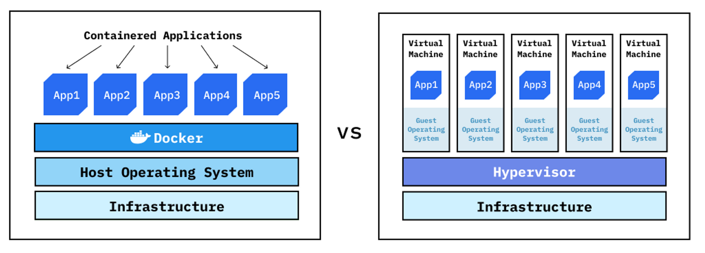
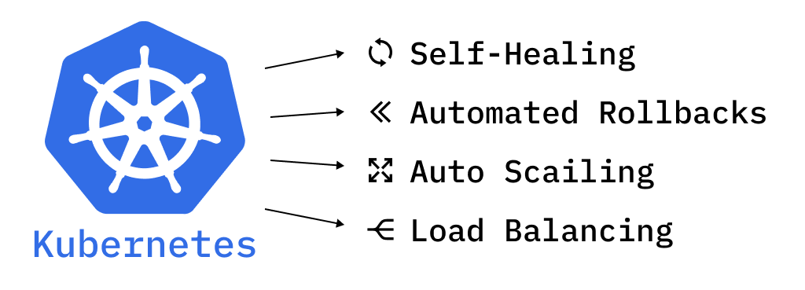

# 쿠버네티스란?

## Container

- 애플리케이션과 그것을 실행하는데 필요한 모든 의존성(코드, 런타임, 시스템 도구, 시스템 라이브러리 등)을 패키징하는 기술이다.
- 컨테이너 런타임(Docker, containerd) 위에서 실행되며, 호스트 OS의 커널을 공유한다.
- 컨테이너와 VM 모두 애플리케이션과 그 의존성을 격리된 환경에서 실행하는데 사용되지만, 컨테이너는 여러 애플리케이션 간에 하나의 운영체제를 공유하기 때문에 OS를 꼭 포함하고 있어야하는 VM보다 훨씬 가볍다.

## 컨테이너 오케스트레이션 도구(Container Orchestration Tool)

- 컨테이너화된 애플리케이션은 애플리케이션의 리소스 요구사항에 기반하여 스케일업 혹은 스케일 다운 할 수 있어야 한다. 이런 비즈니스 요구사항을 충족시키기 위해서 효율적으로 컨테이너들을 관리하고 스케줄링하기 위한 도구의 필요성이 증대하였다.
- 쿠버네티스는 이러한 컨테이너 오케스트레이션 도구 중의 하나로, 운영환경에서 컨테이너가 다운 타임 없이 실행될 수 있도록 관리하는 역할을 한다.
- **선언적(Declarative) 방식의 배포**: 원하는 상태를 정의한 YAML 파일의 실행으로 한번에 여러 개의 인스턴스를 실행하고, 상태를 유지할 수 있다.
- **자동 스케일링(Auto Scaling)**: 리소스 사용량 혹은 트래픽 변동에 따라 자동으로 컨테이너 인스턴스의 수를 동적으로 조절할 수 있다.
- **서비스 디스커버리(Service Discovery)**: 쿠버네티스에서는 컨테이너들이 외부에서 접근 가능하도록 일관된 IP와 DNS 이름을 제공하는 서비스라는 오브젝트를 제공하고 이를 통해 클러스터 내외부에서 해당 서비스와 연결된 컨테이너에 접근할 수 있다.
- **로드 발란서(Load Balancer)** : 하나의 마이크로 서비스의 여러 개의 인스탠스들의 로드를 분배할 수 있다.
- **자동 복구(Self-Healing)**: 컨테이너가 오류로 다운되거나 문제가 발생하면, 헬스 체크 후 자동으로 새로운 인스탠스를 실행시킬 수 있다.
- **제로 다운 타임 배포(Zero Downtime Deployments)**: V1 → V2로 갈 때, 다운 타임 없이 새로운 버전을 릴리즈할 수 있다.
