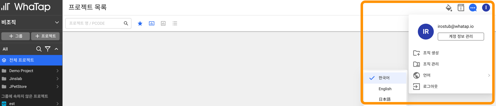
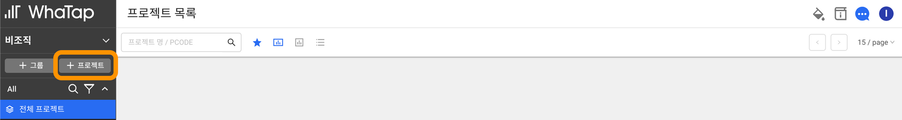
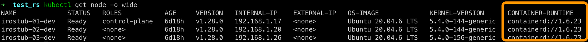
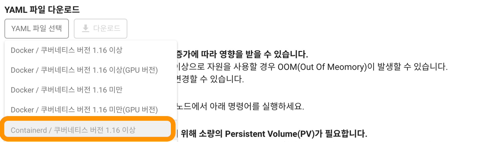

# 모니터링 설치

### WhaTap 회원가입 및 로그인

https://service.whatap.io/account/login

### 계정 언어 설정 변경



### WhaTap Kubernetes 모니터링 프로젝트 생성



프로젝트 명 : (자율)

데이터 서버 지역 : Korea-AWS-Seoul

타임 존 : (GMT +9:00) Seoul, Tokyo, Yakutsk

### 컨테이너 런타임 버전 확인

```bash
kubectl get node -o wide
```



### 컨테이너 버전에 맞는 YAML 파일 다운로드



다운로드 한 파일을 control-plane 으로 복사

### WhaTap Kubernetes 모니터링 에이전트 배포

```bash
kubectl apply -f whatap_kube_containerd_1.16.yaml
```