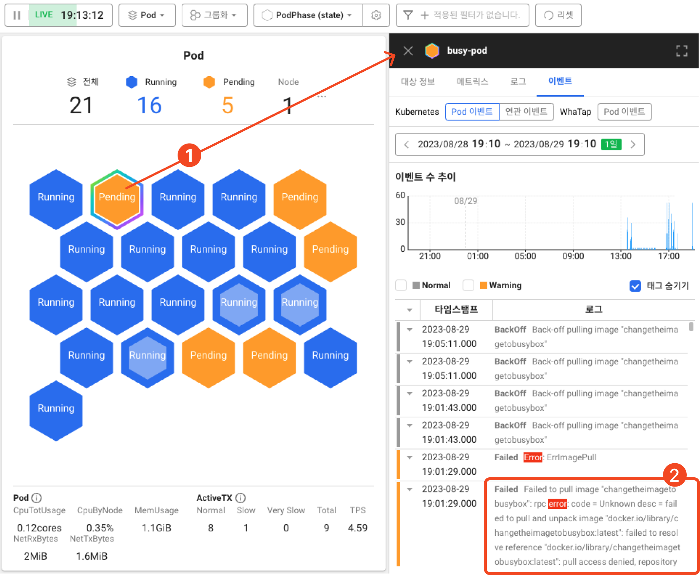

# 문제 원인 찾기: 1. 이벤트 확인

쿠버네티스는 클러스터 내부에서 발생한 이벤트 정보를 제공합니다.

이벤트는 이름 그대로 클러스터 내에서 발생한 이벤트 목록을 담고 있는 쿠버네티스 리소스로, 일반적으로는 시스템 리소스의 상태 변화를 알 수 있습니다.

문제 파드의 이벤트를 확인해 Pending 상태가 지속되는 이유를 알아보겠습니다.

1. Pending 상태의 파드를 클릭하면 상세 탭이 열립니다.
2. **_이벤트_** 탭을 클릭하면 **선택한 파드에서 발생한 이벤트를 확인**할 수 있습니다.

:::tip `ErrImagePull` 에러

이벤트 목록을 보면 `failed to resolve reference "[docker.io/library/changetheimagetobusybox:latest](http://docker.io/library/changetheimagetobusybox:latest)": pull access denied, repository does not exist or may require authorization` 라는 이벤트를 볼 수 있습니다. 해당 에러는 **컨테이너 생성 시 사용하는 이미지를 정상적으로 받아오지 못했을 경우 발생**합니다.

:::

현재 상황에서는 실습을 위해 `changetheimagetobusybox` 라는 존재하지 않는 이미지를 사용하도록 지정해두었기 때문에 문제가 발생했습니다.

문제를 해결하기 위해 해당 이미지를 사용하는 곳을 찾아 `busybox` 라는 이미지로 교체해주어야 합니다.
