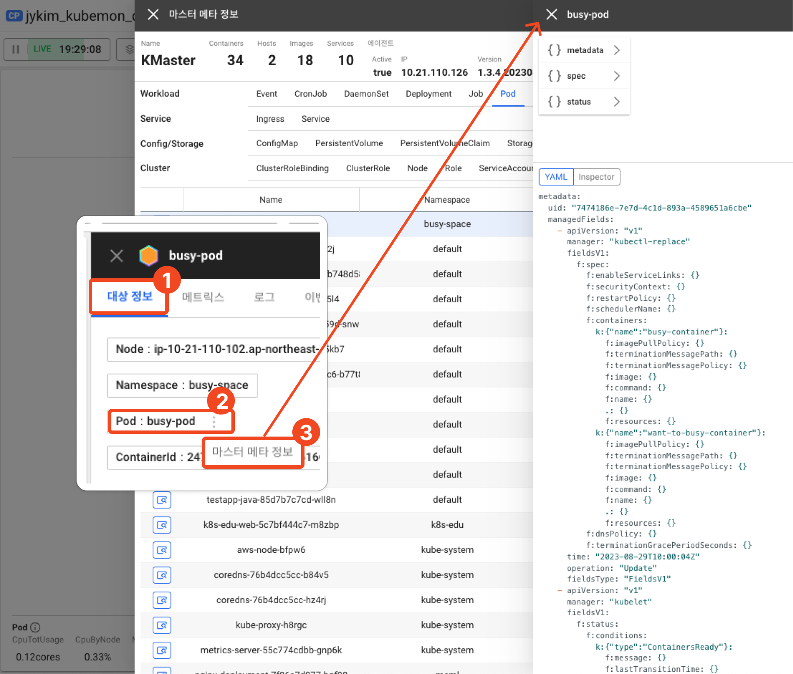
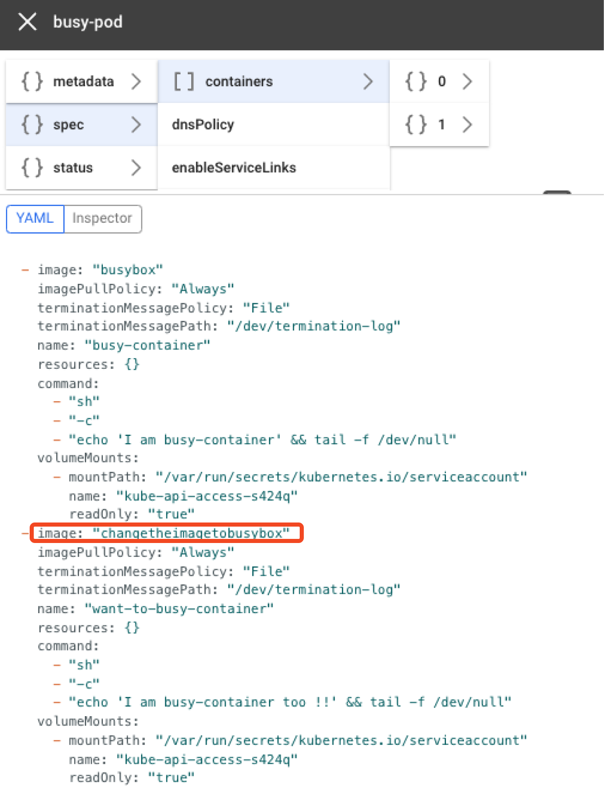

# 문제 원인 찾기: 2. 메타 정보 확인

이벤트를 통해 문제가 되는 지점을 발견했다면, 메타 정보를 통해 실행 파일에서 문제가 되는 위치를 찾을 수 있습니다.  
쿠버네티스는 생성된 오브젝트의 정보를 내부 저장소에 보관하고 있는데, 해당 정보를 통해 문제가 되는 컨테이너를 확인할 수 있습니다.

1. **_대상 정보_** 탭으로 들어가면 **선택 대상에 대한 주요 메타 정보를 확인**할 수 있습니다.
2. 각 메타 정보 옆 더보기(•••) 버튼을 클릭하면 메타와 관련된 추천 메뉴를 확인할 수 있습니다.
3. Pod의 **_마스터 메타 정보_**를 클릭해 **해당 파드를 정의한 실행 파일을 확인**합니다.

컨테이너의 이미지는 `spec.containers[*].image` 에 정의합니다.

`want-to-busy-container` 라는 컨테이너에서 문제가 되는 `changetheimagetobusybox` 이미지를 사용하는것이 확인됩니다.
