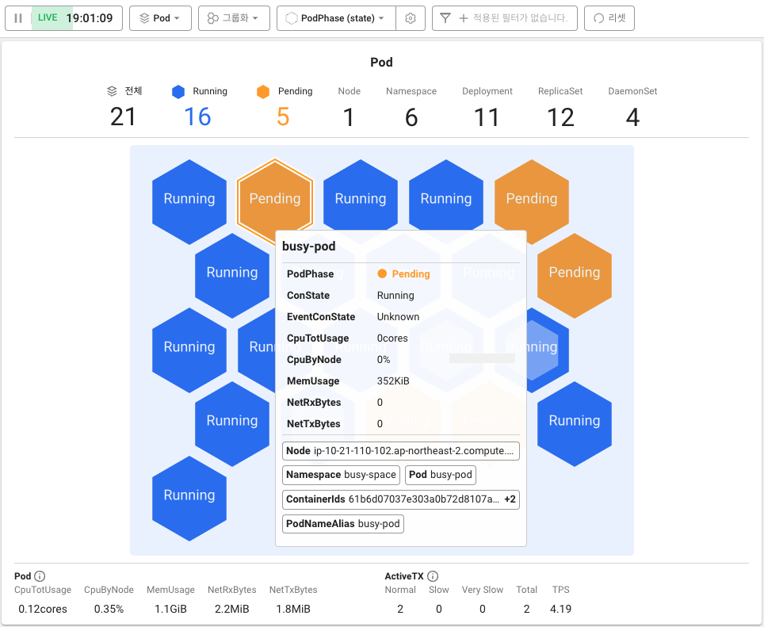

# 문제 발견하기

[오브젝트 다루기 (실습)](../object-handling/general-command) 에서 생성한 리소스들을 컨테이너맵 메뉴에서 모니터링하고 있는데, `busy-pod` 라는 이름의 파드 하나가 계속 Pending 상태로 표시되고 있습니다.

파드는 정의된 수명 주기를 따르는데, Pending 상태에서 시작해서 모든 컨테이너가 정상적으로 시작되면 Running으로 변한 다음, 파드의 컨테이너가 성공적으로 종료되었는지에 따라 Succeeded 또는 Failed 단계를 거칩니다.

`busy-pod` 를 Running 상태로 바꾸기 위해 원인을 찾아 문제를 해결해야 합니다.

:::note Pending 상태란?

파드가 쿠버네티스 클러스터에서 승인되었지만, 하나 이상의 컨테이너가 설정되지 않았고 실행할 준비가 되지 않은 상태입니다. 여기에는 파드가 스케줄되기 이전까지의 시간 뿐만 아니라 네트워크를 통한 컨테이너 이미지 다운로드 시간도 포함됩니다. 
[쿠버네티스 공식 문서](https://kubernetes.io/ko/docs/concepts/workloads/pods/pod-lifecycle/)

:::
