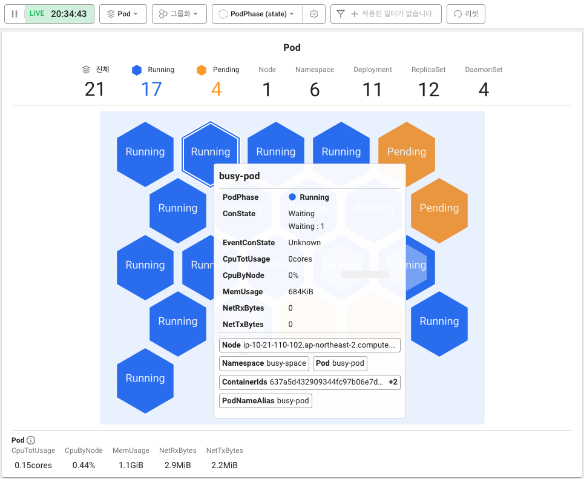
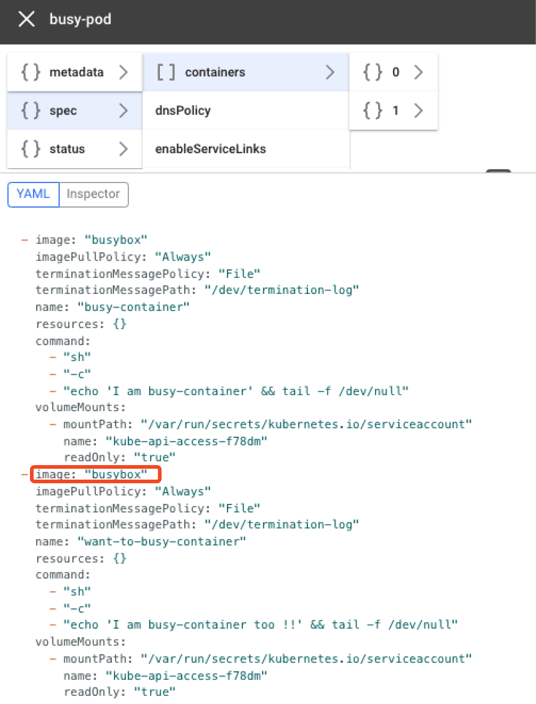

# 문제 해결하기

문제가 되는 이미지를 `busybox` 라는 이미지로 교체해서 파드가 정상적으로 동작하도록 수정합니다.

`want-to-busy-container` 의 이미지를 `busybox` 로 수정해놓은 `busy-pod.yaml` 이라는 파일을 `busy-pod` 에 적용합니다.

```bash
kubectl apply -f https://raw.githubusercontent.com/whatap/k8s-edu-storage/030d4889b1c52b7c836c21bc12d19d6c00216369/k8s-object/busy-pod.yaml
```

명령어를 실행한 후 파드의 상태를 컨테이너맵에서 실시간으로 확인해볼 수 있습니다.



마스터 메타 정보 화면에서 수정한 실행 파일이 잘 적용되었는지 확인합니다.



컨테이너맵에서 busy-pod의 상태가 Running이고, `want-to-busy-container` 컨테이너에 `busybox` 이미지가 적용된 것을 확인할 수 있습니다.
